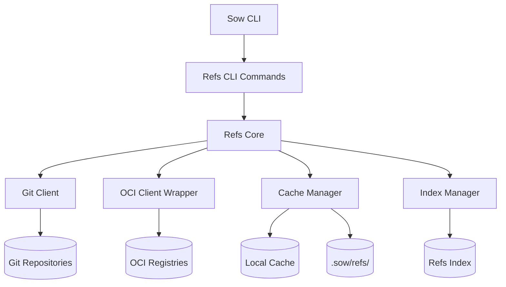
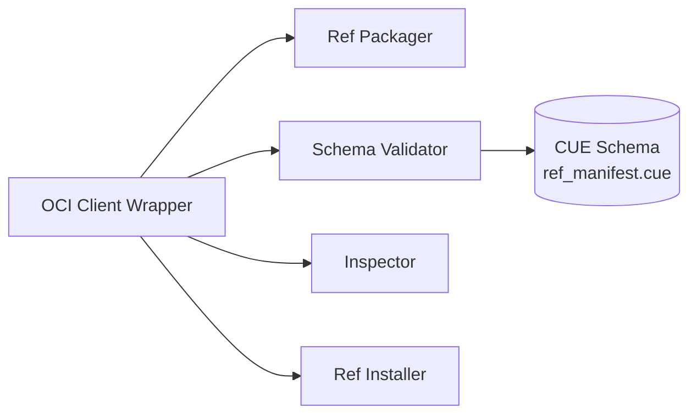

# Arc42 Section 5: Building Block View - Refs Subsystem

**Document**: Building Block View for Refs Subsystem with OCI Integration
**Related ADR**: [ADR-003: Use OCI Registries for Refs Distribution](../adrs/adr-003-oci-refs-distribution.md)
**Date**: 2025-10-30

## Level 1: Refs Subsystem Overview

### Components

**Refs CLI Commands**: Command interface (publish, inspect, add, update, remove, list, prune, migrate)

**Refs Core**: Business logic orchestration, URL format detection, security enforcement

**OCI Client Wrapper**: Interface to `github.com/jmgilman/go/oci` with estargz support
- Push/pull images
- ListFiles (TOC-only download)
- Selective extraction with multiple glob patterns (OR logic: match any pattern)
- Security: path traversal protection, size limits, permission sanitization

**Git Client**: Legacy git operations (deprecated for new refs)

**Cache Manager**: Digest-based cache management at `~/.cache/sow/refs/`

**Index Manager**: Maintain `.sow/refs/index.json` with file locking, stores ref metadata from `.sow-ref.yaml` (title, description, classifications, tags, authors, license)

## Level 2: OCI Client Wrapper Internals

### Sub-components

**Ref Packager**: Create estargz OCI images from directories
- Validate `.sow-ref.yaml` via Schema Validator
- Apply exclusions, create estargz archive
- Map metadata to OCI annotations

**Schema Validator**: CUE-based validation
- Schema: `cli/schemas/ref_manifest.cue` (embedded)
- Validates required fields, formats, constraints
- Returns detailed field-level errors

**Inspector**: Pre-inspection without full download
- `ListFiles` downloads TOC only (~5KB)
- Selectively extracts `.sow-ref.yaml` (~2KB)
- Total bandwidth: < 10KB

**Ref Installer**: Install to cache and workspace
- Pull full or selective (multiple glob patterns supported)
- Atomic extraction via temp directory
- Create symlink, update index, trigger search indexing
- Files matching any glob pattern are downloaded

## Configuration

**.sow-ref.yaml Schema**:
- `schema_version`, `ref.title`, `ref.link` (required)
- `content.description`, `content.classifications[]`, `content.tags[]` (required)
- `provenance.*`, `packaging.exclude`, `hints.*` (optional)
- CUE schema at `cli/schemas/ref_manifest.cue`

**OCI Annotations**: Metadata mapped to standard annotations for queryability

**Index Schema** (`.sow/refs/index.json`):
- Installation metadata: `id`, `source`, `digest`, `link`, `installed_at`, `selective.globs[]`, `selective.partial`
- Ref metadata (from `.sow-ref.yaml`): `title`, `description`, `classifications`, `tags`, `authors`, `license`
- `selective.globs` is array of glob patterns (multiple `--path` flags)
- Enables fast querying without reading ref contents

## Quality Attributes

**Performance**:
- Publish 10MB: < 30s
- Inspect: < 3s, < 10KB bandwidth
- Full install 10MB: < 15s
- Selective install (10%): < 3s, 85% faster

**Security**: Path traversal protection, size limits (100MB/file, 1GB total), permission sanitization

**Storage**: 70-80% compression, digest-based deduplication

## References

- **ADR-003**: [Use OCI Registries](../adrs/adr-003-oci-refs-distribution.md)
- **Design**: [OCI Refs Design](../designs/oci-refs-design.md)
- **Exploration**: `.sow/knowledge/explorations/improve-refs-2025-10/`
