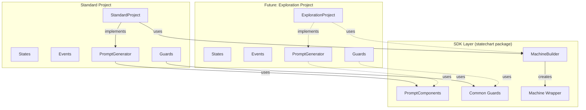
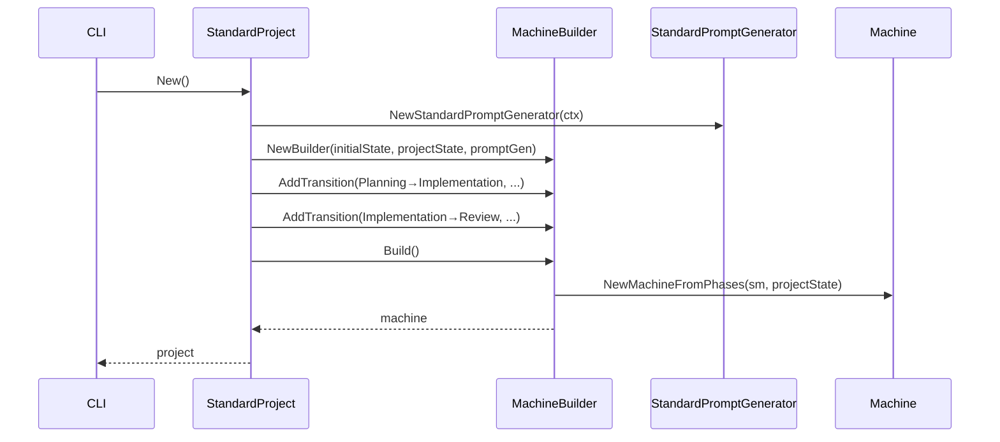
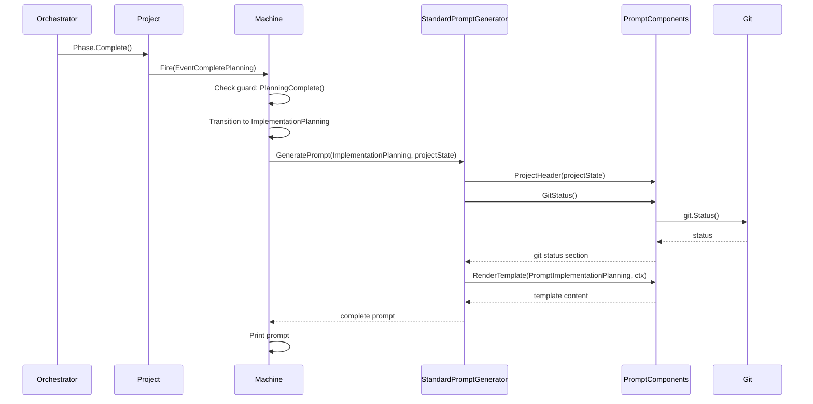

# State Machine SDK Design

**Author**: Architecture Team
**Date**: 2025-01-28
**Status**: Proposed
**Reviewers**: TBD

## Overview

Create a reusable SDK layer for project state machine configuration that enables multiple project types to define their own state machines without code duplication. The SDK provides common building blocks (guards, prompt generation, transition configuration) while allowing each project type to own its specific states, events, and workflow logic.

Currently, the state machine system is hardcoded for the standard project type within `cli/internal/project/statechart/`. Future project types (exploration, design, breakdown) cannot define their own state machines without modifying shared code or duplicating infrastructure logic.

This design introduces a builder pattern and component library that projects use to construct their state machines, replacing the current monolithic `configure()` function with project-owned configuration.

## Goals and Non-Goals

**Goals**:
- Enable multiple project types to define independent state machines
- Eliminate duplication of common state machine patterns (guards, transitions, prompt generation)
- Provide project types full control over prompt generation including external system access (git, GitHub, filesystem)
- Maintain zero-context resumability through state machine persistence
- Support both template-based and code-based prompt generation
- Keep state machine configuration collocated with project type implementation

**Non-Goals** (explicitly out of scope):
- Migrate existing modes to project types (covered by separate design)
- Change state machine persistence format or location
- Modify Phase or Task domain interfaces
- Add new project types beyond standard (future work after SDK is proven)
- Runtime state machine reconfiguration (state machines are static per project type)

## Background

### Current State

The state machine system lives in `cli/internal/project/statechart/` and contains:

1. **Hard-coded configuration** (`machine.go:configure()`): All states, events, transitions, and guards for the standard project are defined in a single function called during machine initialization.

2. **Standard-specific states** (`states.go`): States like `PlanningActive`, `ImplementationPlanning`, `ImplementationExecuting` are defined as package-level constants.

3. **Standard-specific events** (`events.go`): Events like `EventCompletePlanning`, `EventTasksApproved` are specific to the standard workflow.

4. **Template-only prompts** (`prompts.go`): Prompt generation limited to template rendering with `ProjectState` context, no access to external systems.

5. **Escape hatch** (`machine_new.go:NewMachineFromPhases()`): Function exists to wrap a pre-configured state machine, suggesting someone anticipated this need, but it's unused.

### Problem Statement

**Issue 1: Project Type Coupling**
- `StandardProject.buildStateMachine()` calls `statechart.NewMachineAt()` which calls `configure()` with standard-specific logic
- Adding new project types would require either:
  - Modifying shared `configure()` with conditionals (violates Open/Closed Principle)
  - Duplicating state machine infrastructure in each project type
  - Creating multiple incompatible forks of the statechart package

**Issue 2: Prompt Generation Limitations**
- Templates cannot access git status, recent commits, open issues, or filesystem beyond project state
- Complex logic (conditionals, filtering, data transformations) impossible in templates
- Dynamic prompt composition based on runtime state unsupported
- Forces bloating project state with prompt-specific data

**Issue 3: Terminology Confusion**
- State machine concepts (states, events) mixed with domain concepts (phases)
- No clear boundary between shared infrastructure and project-specific configuration

### Requirements

**Functional Requirements**:
- FR1: Projects must define their own states without modifying shared code
- FR2: Projects must define their own events and guards specific to their workflow
- FR3: Projects must generate prompts with access to external systems (git, GitHub, filesystem)
- FR4: Projects must reuse common state machine patterns without duplication
- FR5: State machine configuration must persist and restore exactly as before

**Non-Functional Requirements**:
- NFR1: Zero breaking changes to existing standard project behavior
- NFR2: State machine performance unchanged (no additional overhead)
- NFR3: Clear separation between SDK layer (statechart package) and project types
- NFR4: Testability improved (projects can test their state machines independently)

## Design

### Architecture Overview



The SDK layer provides infrastructure without project-specific logic. Each project type owns its states, events, guards, and prompt generation, using SDK components to avoid duplication.

### Component Breakdown

#### MachineBuilder (SDK)

**Responsibility**: Fluent API for constructing state machines

**Key Behaviors**:
- Accept project-provided prompt generator
- Configure state transitions with guards
- Wire prompt generation into state entry actions
- Build final Machine instance

**Interface**:
```go
type MachineBuilder struct {
    sm              *stateless.StateMachine
    projectState    *schemas.ProjectState
    promptGenerator PromptGenerator
}

func NewBuilder(
    initialState State,
    projectState *schemas.ProjectState,
    promptGenerator PromptGenerator,
) *MachineBuilder

func (b *MachineBuilder) AddTransition(
    from, to State,
    event Event,
    guard GuardFunc,
) *MachineBuilder

func (b *MachineBuilder) AddUnconditionalTransition(
    from, to State,
    event Event,
) *MachineBuilder

func (b *MachineBuilder) ConfigureState(state State) *stateless.StateConfiguration

func (b *MachineBuilder) Build() *Machine
```

**Dependencies**: `stateless` library, `PromptGenerator` interface

#### PromptGenerator (SDK Interface)

**Responsibility**: Contract for project-owned prompt generation

**Key Behaviors**:
- Generate prompts for specific states
- Access full project context including external systems
- Return rendered prompt string or error

**Interface**:
```go
type PromptGenerator interface {
    GeneratePrompt(state State, projectState *schemas.ProjectState) (string, error)
}
```

**Dependencies**: None (interface only)

#### PromptComponents (SDK)

**Responsibility**: Reusable prompt building blocks

**Key Behaviors**:
- Provide common prompt sections (project header, git status, task summaries)
- Access external systems via sow.Context (git, GitHub, filesystem)
- Render templates for static guidance text
- Compose sections into complete prompts

**Interface**:
```go
type PromptComponents struct {
    ctx *sow.Context
}

func NewPromptComponents(ctx *sow.Context) *PromptComponents

// Reusable prompt sections
func (c *PromptComponents) ProjectHeader(projectState *schemas.ProjectState) string
func (c *PromptComponents) GitStatus() (string, error)
func (c *PromptComponents) RecentCommits(count int) (string, error)
func (c *PromptComponents) TaskSummary(tasks []phases.Task) string
func (c *PromptComponents) OpenIssues() (string, error)

// Template rendering helper
func (c *PromptComponents) RenderTemplate(templateID prompts.PromptID, ctx prompts.Context) (string, error)
```

**Dependencies**: `sow.Context`, `prompts` package

#### Common Guards (SDK)

**Responsibility**: Reusable guard predicates

**Key Behaviors**:
- Check common conditions (all tasks complete, artifacts approved, minimum counts)
- Operate on typed domain objects (tasks, artifacts)
- Return boolean results

**Functions**:
```go
func AllTasksComplete(tasks []phases.Task) bool
func AllArtifactsApproved(artifacts []phases.Artifact) bool
func MinTaskCount(tasks []phases.Task, min int) bool
func HasArtifactWithType(artifacts []phases.Artifact, artifactType string) bool
func AnyTaskInProgress(tasks []phases.Task) bool
```

**Dependencies**: `schemas/phases`

#### StandardProject Integration

**Responsibility**: Standard project owns its state machine configuration

**Key Behaviors**:
- Define standard-specific states, events, guards
- Implement PromptGenerator for standard workflow
- Use MachineBuilder to construct state machine
- Delegate to PromptComponents for common sections

**File Structure**:
```
cli/internal/project/standard/
├── project.go          # buildStateMachine() uses builder
├── states.go           # PlanningActive, ImplementationPlanning, etc.
├── events.go           # EventCompletePlanning, EventTasksApproved, etc.
├── guards.go           # PlanningComplete(), TasksApproved(), etc.
├── prompts.go          # StandardPromptGenerator implementation
└── ...existing files...
```

**Dependencies**: `statechart` (SDK), `sow.Context`, `prompts`

### Data Models

#### State Machine State (unchanged)

State persists in `.sow/project/state.yaml`:

```yaml
statechart:
  current_state: ImplementationExecuting
```

State machine reconstructs at exact state on load via `NewMachineAt()`.

#### GuardFunc Type

```go
type GuardFunc func() bool
```

Guards are closures that capture project state and return boolean indicating if transition is permitted.

### Data Flow

#### Project Initialization Flow



#### State Transition Flow



#### Prompt Generation Example

Standard project generating implementation executing prompt:

```go
func (g *StandardPromptGenerator) generateImplementationExecutingPrompt(
    projectState *schemas.ProjectState,
) (string, error) {
    var buf strings.Builder

    // Reuse common sections
    buf.WriteString(g.components.ProjectHeader(projectState))
    buf.WriteString(g.components.TaskSummary(projectState.Phases.Implementation.Tasks))

    // Conditional logic: include commits if tasks completed
    hasCompleted := false
    for _, t := range projectState.Phases.Implementation.Tasks {
        if t.Status == "completed" {
            hasCompleted = true
            break
        }
    }

    if hasCompleted {
        commits, err := g.components.RecentCommits(5)
        if err != nil {
            return "", err
        }
        buf.WriteString(commits)
    }

    // Static guidance from template
    templateCtx := &prompts.StatechartContext{
        State:        string(ImplementationExecuting),
        ProjectState: projectState,
    }
    guidance, err := g.components.RenderTemplate(
        prompts.PromptImplementationExecuting,
        templateCtx,
    )
    if err != nil {
        return "", err
    }
    buf.WriteString(guidance)

    return buf.String(), nil
}
```

## Error Handling

**Prompt generation failure**: Return error, machine entry action propagates error, transition fails, state unchanged. Orchestrator sees error and can retry or report to user.

**Guard evaluation failure**: Guards return boolean only, no errors. Complex validation should happen in Phase.Complete() before firing event.

**Builder misconfiguration**: Builder validates during Build() that all states have at least one entry/exit, all events are wired. Returns error if misconfigured.

**External system unavailable** (git, GitHub): PromptComponents methods return errors. Prompt generators can choose to:
- Propagate error (fail transition)
- Skip section (degrade gracefully)
- Use cached/default data

Standard project will propagate critical errors (git status) but skip optional data (open issues).

## Security/Privacy Considerations

**No additional security implications**: SDK operates on same data and systems as existing code. Prompt generation accesses git/GitHub via existing authenticated sow.Context.

**Prompt content**: Prompts may include commit messages, branch names, issue titles. This data already accessible to orchestrator. No new sensitive data exposure.

## Performance Considerations

**State machine construction**: Happens once during project load. Builder adds negligible overhead (fluent API, no allocations).

**Prompt generation**: Replaces template-only rendering with Go code + optional template rendering. Performance unchanged or improved (no template parsing overhead if pure code used).

**External system calls**: Prompt generation may call git/GitHub. This is new but intentional. Cache where appropriate (PromptComponents can cache git status for 5 seconds, issues for 1 minute).

**Memory**: No additional allocations. Builder constructs machine once, discarded after Build().

## Testing Strategy

**Unit Tests**:
- MachineBuilder: Test transition configuration, guard wiring, prompt generation wiring
- PromptComponents: Test each section generator independently
- Common guards: Test predicates with various task/artifact states
- StandardPromptGenerator: Test state-specific prompt generation with mocked components

**Integration Tests**:
- Standard project: Full state machine construction and transitions
- Prompt generation: Full prompt generation with real git/GitHub (test doubles)
- State persistence: Save/load cycle maintains machine state

**Backward Compatibility Tests**:
- Standard project state machine behaves identically to pre-SDK version
- All existing standard project tests pass unchanged
- State machine persistence format unchanged

## Alternatives Considered

### Option 1: Configuration-Based State Machines

**Description**: Define state machines in YAML/CUE configuration files. CLI loads configuration and constructs machine dynamically.

**Pros**:
- No code changes to add new project types
- State machines visible in configuration
- Could support user-defined project types

**Cons**:
- Guards and prompt generation still require code
- Configuration complexity high (events, guards, transitions)
- Type safety lost (strings instead of constants)
- Debugging harder (configuration parsing errors vs compile errors)
- No clear win over code-based builder (configuration just moves complexity)

**Why not chosen**: Complexity moved to configuration without eliminating code. Guards and prompts still need Go code, so state machine configuration gains little. Builder pattern provides same extensibility with better type safety and IDE support.

### Option 2: Inheritance-Based State Machines

**Description**: Create abstract base state machine class that projects extend. Override methods for state-specific behavior.

**Pros**:
- Familiar OOP pattern
- Shared behavior in base class
- Projects override only what differs

**Cons**:
- Go doesn't have inheritance, would need embedding
- Tight coupling between base and projects
- Hard to test (can't mock base class methods easily)
- Fragile base class problem (changes ripple to all projects)
- Less flexible than composition

**Why not chosen**: Composition (builder + components) is more idiomatic Go. Avoids coupling and fragile base class issues. Projects have full control without inheritance constraints.

### Option 3: Keep Template-Only Prompts, Extend Context

**Description**: Keep current template-based prompts but extend StatechartContext to include git status, issues, etc.

**Pros**:
- Smaller change (no PromptGenerator interface)
- Templates remain central to prompting
- No project-specific prompt code

**Cons**:
- Context bloats with every prompt need (git status, commits, issues, filesystem)
- Context gathering happens even if prompt doesn't use it (performance waste)
- Complex logic still impossible in templates
- Dynamic composition still unsupported
- External system failures harder to handle in template rendering

**Why not chosen**: Doesn't solve core limitation (templates too restrictive). Adding data to context doesn't enable complex logic. Project-owned generation gives full flexibility while still allowing template use via RenderTemplate() helper.

## Open Questions

- [ ] Should PromptComponents cache external system calls? If yes, what TTLs?
- [ ] Should builder validate that all states are reachable from initial state?
- [ ] Should we provide a testing helper that validates state machine completeness?
- [ ] Should common guards live in statechart package or separate guards package?

## References

- [ADR-003: Consolidate Operating Modes into Project Types](../.sow/knowledge/adrs/003-consolidate-modes-to-projects.md) - Motivates need for multiple project types
- [Project Modes Implementation Design](../.sow/knowledge/designs/project-modes-design.md) - Defines future project types that will use this SDK
- [qmuntal/stateless](https://github.com/qmuntal/stateless) - Underlying state machine library

## Future Considerations

**State machine visualization**: Builder could export DOT format graph of states and transitions for documentation.

**State machine validation**: Builder could detect unreachable states, missing guards, or dead-end states during Build().

**Prompt caching**: PromptComponents could cache expensive operations (filesystem scans, GitHub API calls) with configurable TTLs.

**Prompt testing**: Provide test helpers that validate prompt generation for all states without requiring full project state.

**Project type registry**: Projects could self-register their types, enabling dynamic project type discovery.

**Shared state machines**: Multiple project types could share state machine definitions if workflows identical (unlikely but possible).

## Implementation Plan

### Phase 1: SDK Layer (1-2 days)

**Deliverables**:
- Create `statechart/builder.go` with MachineBuilder
- Create `statechart/prompt_generator.go` with PromptGenerator interface
- Create `statechart/prompt_components.go` with PromptComponents
- Create `statechart/common_guards.go` with common guard functions
- Unit tests for all SDK components

**Dependencies**: None

**Validation**: Unit tests pass, SDK compiles, interfaces are clear

### Phase 2: Extract Standard Project Configuration (1 day)

**Deliverables**:
- Create `standard/states.go` (move from statechart)
- Create `standard/events.go` (move from statechart)
- Create `standard/guards.go` (extract from statechart/guards.go, keep only standard-specific)
- Move common guards to `statechart/common_guards.go`

**Dependencies**: Phase 1 complete

**Validation**: Standard project still compiles, tests pass (may need updates for new paths)

### Phase 3: Standard Project Prompt Generator (2 days)

**Deliverables**:
- Create `standard/prompts.go` with StandardPromptGenerator
- Implement state-specific prompt generation methods
- Use PromptComponents for reusable sections
- Mix templates and code for optimal flexibility

**Dependencies**: Phase 2 complete

**Validation**: Prompts generated match current template output (or are intentionally improved), manual testing shows git status appears

### Phase 4: Standard Project Builder Integration (1 day)

**Deliverables**:
- Update `standard/project.go:buildStateMachine()` to use MachineBuilder
- Wire StandardPromptGenerator into builder
- Remove old `statechart.NewMachineAt()` + `configure()` path
- Update tests for new architecture

**Dependencies**: Phase 3 complete

**Validation**: All existing standard project tests pass, integration tests show state machine works identically

### Phase 5: Cleanup and Documentation (1 day)

**Deliverables**:
- Remove unused `statechart/prompts.go:statePrompts` map (now in StandardPromptMapper)
- Remove `statechart/machine.go:configure()` (replaced by builder)
- Update godoc comments throughout statechart package
- Update `.claude/CLAUDE.md` with SDK architecture
- Create example code showing how future projects use SDK

**Dependencies**: Phase 4 complete

**Validation**: Code review, documentation review, no dead code remains

**Total estimated time**: 5-7 days

## Migration/Rollout Strategy

**No migration needed**: This is a refactoring with zero user-visible changes. Standard project behavior unchanged.

**Rollback plan**: Revert commits in reverse phase order. Phase 1-3 are additive (no deletions), easy to revert. Phase 4 modifies standard project but changes are isolated to `buildStateMachine()`.

**Verification**: Run full test suite after each phase. Manual testing with real project after phase 4. Compare state.yaml before/after to confirm no persistence changes.

## Monitoring and Observability

**No new monitoring needed**: SDK operates at project initialization time, no runtime metrics required.

**Debugging**: State machine transitions already logged via project log. Prompt generation could optionally log component usage for debugging (disabled by default).

## Validation Checklist

**Design document**:
- [x] Overview clearly states what is being built
- [x] Goals are specific and measurable
- [x] Non-goals explicitly listed
- [x] Design approach clearly described
- [x] Key components identified
- [x] Data flow explained with diagrams
- [x] Minimum 2 alternatives documented with rejection reasons
- [x] Testing approach described
- [x] Length appropriate for complexity (comprehensive: 6-8 pages)

**Content quality**:
- [x] No implementation code included (only interface signatures and examples)
- [x] Not written as implementation tutorial
- [x] Specific technologies and numbers included (phase count, time estimates)
- [x] Alternatives presented fairly with real trade-offs
- [x] Context (why) provided before solution (what)
- [x] Diagrams are clear and labeled
- [x] Background section explains current state and problems
- [x] Error handling strategy documented
- [x] References to related designs included
- [x] Implementation plan with phases and timeline
