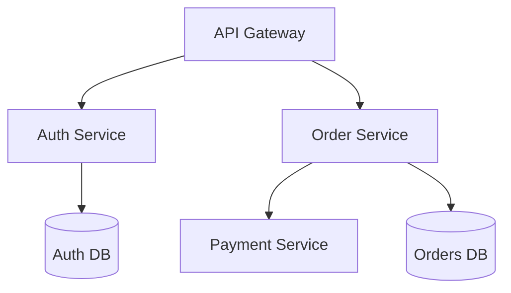
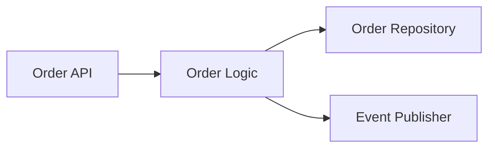

# Arc42 Architecture Documentation Guidance

Generate Arc42 architecture documentation using the standardized 12-section structure. Arc42 provides comprehensive, living documentation for software architecture that evolves with the system.

## Scope Rules

**CREATE ARC42 FOR:**
- New services after reaching sufficient complexity
- Systems requiring coordination across multiple teams
- Services where architecture must be explicitly documented

**UPDATE ARC42 WHEN:**
- Adding/removing components or containers
- Changing component interactions
- Introducing new architectural patterns
- Making architectural decisions
- Adding external integrations
- Changing deployment infrastructure

**DO NOT CREATE ARC42 FOR:**
- Simple single-service applications without justification
- Proof-of-concept or prototype systems
- Services that haven't reached architectural complexity

## Prohibitions

- Never combine multiple sections into one file
- Never include implementation details (those belong in design docs)
- Never omit diagrams from sections 3, 5, 6, 7
- Never create all 12 sections at once for new services (start with minimum viable set)
- Never let documentation drift from reality
- Refuse requests to generate complete Arc42 for simple applications

## File Structure

Store Arc42 as separate files, one per section:

```
.sow/knowledge/architecture/arc42/
├── 01-introduction.md
├── 02-constraints.md
├── 03-context-scope.md
├── 04-solution-strategy.md
├── 05-building-blocks.md
├── 06-runtime-view.md
├── 07-deployment.md
├── 08-crosscutting-concepts.md
├── 09-architecture-decisions.md
├── 10-quality-requirements.md
├── 11-risks-debt.md
└── 12-glossary.md
```

Separate files enable targeted updates, clearer version control, and manageable file sizes.

## Minimum Viable Arc42

Start new services with essential sections only:
- Section 1: Introduction and Goals
- Section 3: Context and Scope
- Section 5: Building Block View
- Section 9: Architecture Decisions

Add remaining sections as needs emerge:
- Section 2: Constraints (when constraints identified)
- Section 4: Solution Strategy (when architecture stabilizes)
- Section 6: Runtime View (for complex flows)
- Section 7: Deployment (when deployed)
- Section 8: Cross-cutting Concepts (when patterns emerge)
- Section 10: Quality Requirements (when formalized)
- Section 11: Risks (as identified)
- Section 12: Glossary (as terminology grows)

## Section Reference

### 1. Introduction and Goals
**Purpose**: High-level overview and key requirements
**Content**: Requirements overview (2-3 paragraphs on system purpose and users), key functional requirements (bulleted), quality goals (top 3-5, prioritized with specific targets like "< 100ms p95"), stakeholders table (role, expectations)
**Update triggers**: Service inception, major scope changes

### 2. Architecture Constraints
**Purpose**: Technical and organizational constraints limiting design choices
**Content**: Technical constraints table (constraint, description, rationale), organizational constraints table (constraint, description, impact), conventions list (code, API, documentation standards)
**Update triggers**: New constraints added, constraints removed

### 3. System Context and Scope
**Purpose**: System boundary and external interfaces
**Content**: Business context diagram (system and business-level interactions), external entities list, technical context diagram (protocols, data formats), interfaces specification (technology, auth, data format for each external connection)
**Update triggers**: New external integrations, removed dependencies
**Diagram required**: Yes (context diagram)

### 4. Solution Strategy
**Purpose**: High-level approach and key architectural decisions
**Content**: Architectural approach (2-3 paragraphs on overall strategy), key decisions list (pattern/technology with rationale), technology choices table (aspect, choice, rationale), quality attribute solutions (how architecture addresses each quality goal)
**Update triggers**: Major architectural changes, new patterns adopted

### 5. Building Block View
**Purpose**: Static structure - components and relationships
**Content**: Level 1 (system overview showing containers/services with diagram), component descriptions, Level 2+ (internals of complex components with sub-component diagrams and descriptions)
**Update triggers**: New services/components added, removed, or restructured
**Diagram required**: Yes (component/container diagram for each level)

### 6. Runtime View
**Purpose**: Dynamic behavior - component interactions at runtime
**Content**: Key scenarios (2-5 critical flows), sequence diagrams or step-by-step flows for each scenario, interaction descriptions
**Update triggers**: New flows added, significant flow changes
**Diagram required**: Yes (sequence diagrams)

### 7. Deployment View
**Purpose**: Infrastructure and deployment architecture
**Content**: Infrastructure overview diagram, environments table (environment, purpose, infrastructure), deployment process (step-by-step)
**Update triggers**: Infrastructure changes, new environments
**Diagram required**: Yes (deployment diagram)

### 8. Cross-cutting Concepts
**Purpose**: Common patterns and principles used across the system
**Content**: Domain model (core concepts), security (authentication, authorization, data protection), error handling (strategy, codes, formats), logging and monitoring (structured logging, metrics, alerts), testing strategy (types, coverage targets)
**Update triggers**: New patterns adopted, principles changed

### 9. Architecture Decisions
**Purpose**: Index of all ADRs
**Content**: Decision log table (ID, title, status, date with links to ADR files), key decisions summary (one paragraph per ADR with decision, rationale, status)
**Update triggers**: Every new ADR created

### 10. Quality Requirements
**Purpose**: Detailed quality attribute requirements
**Content**: Quality tree (hierarchical structure with metrics), quality scenarios (detailed scenarios with source, stimulus, response, metric for each quality attribute)
**Update triggers**: Quality requirements change, new requirements added

### 11. Risks and Technical Debt
**Purpose**: Known issues, risks, and technical debt
**Content**: Technical risks table (risk, probability, impact, mitigation), technical debt table (item, impact, effort, priority), debt repayment plan (prioritized timeline)
**Update triggers**: New risks identified, debt items added/resolved

### 12. Glossary
**Purpose**: Common terminology and domain concepts
**Content**: Terms table (term, definition) including domain terms, technical terms, acronyms
**Update triggers**: New terms introduced, definitions clarified

## Update Mapping

| Change | Sections to Update |
|--------|-------------------|
| New service component | 5 (Building Blocks), 6 (Runtime), 7 (Deployment) |
| New external integration | 3 (Context), 6 (Runtime) |
| Architectural decision | 4 (Solution Strategy), 9 (Decisions), affected sections |
| New quality requirement | 1 (Goals), 10 (Quality Requirements) |
| New constraint | 2 (Constraints) |
| New pattern/principle | 8 (Cross-cutting Concepts) |
| Technical debt identified | 11 (Risks and Debt) |
| New terminology | 12 (Glossary) |

## Integration with Other Documents

**With C4 Diagrams**:
- Section 3 (Context) corresponds to C4 Level 1 (System Context)
- Section 5 (Building Blocks) corresponds to C4 Level 2 (Containers) and Level 3 (Components)
- Section 6 (Runtime View) uses sequence diagrams showing container interactions
- Reference C4 diagrams from Arc42 sections: "See [C4 Container Diagram](../diagrams/c4-container.mmd)"

**With ADRs**:
- Section 9 maintains index of all ADRs
- ADRs provide decision details, Arc42 provides architectural context
- Cross-reference: Arc42 Section 9 links to ADR files, ADRs reference Arc42 sections they affect
- When ADR affects architecture, update relevant Arc42 sections

**With Design Docs**:
- Arc42 documents architecture ("what" and "why")
- Design docs document implementation ("how")
- Link design docs from Arc42 where implementation details needed

## Writing Requirements

**Structure**: Use consistent heading hierarchy. Cross-reference between sections. Link external docs. Maintain table of contents for large sections.

**Conciseness**: Focus on architecturally significant decisions. Omit details belonging in code comments. Use diagrams to reduce text. Link to other docs for details. Limit each section to essential information.

**Diagrams**: Use Mermaid for consistency. Maintain consistent shapes/colors across sections. Limit diagrams to one architectural concern. Remove unnecessary detail.

**Maintenance**: Update Arc42 sections when architecture changes. Treat documentation updates as part of definition of done. Update all related sections together (e.g., new component requires updates to sections 5, 6, 7).

## Example: Building Block View (Section 5)

```markdown
# 5. Building Block View

## Level 1: System Overview

See [C4 Container Diagram](../diagrams/c4-container.mmd) for visual representation.



**Components**:
- **API Gateway**: Routes requests, handles authentication via Auth Service, rate limiting, request validation
- **Auth Service**: User authentication and authorization, manages user sessions, JWT token issuance
- **Order Service**: Order management, order state machine, inventory coordination
- **Payment Service**: Payment processing, integrates with Stripe, handles payment webhooks

## Level 2: Order Service Internals



**Sub-components**:
- **Order API**: HTTP handlers, request validation, response formatting
- **Order Logic**: Business logic, order state transitions, validation rules
- **Order Repository**: Database access layer, query optimization, transaction management
- **Event Publisher**: Publishes events to NATS, handles retry logic, ensures at-least-once delivery

**Component Dependencies**:
- Order Logic depends on Order Repository for persistence
- Order Logic depends on Event Publisher for async notifications
- Order API depends only on Order Logic (no direct repository access)
```

## Example: Architecture Decisions (Section 9)

```markdown
# 9. Architecture Decisions

All architectural decisions are documented as Architecture Decision Records (ADRs). This section maintains the index.

## Decision Log

| ID | Title | Status | Date |
|----|-------|--------|------|
| [ADR-001](../../adrs/adr-001-microservices.md) | Use Microservices Architecture | Accepted | 2024-01-15 |
| [ADR-002](../../adrs/adr-002-event-driven.md) | Event-Driven Communication | Accepted | 2024-01-20 |
| [ADR-003](../../adrs/adr-003-postgresql.md) | PostgreSQL for Data Storage | Accepted | 2024-02-01 |
| [ADR-004](../../adrs/adr-004-nats.md) | NATS for Message Bus | Accepted | 2024-02-10 |

## Key Decisions Summary

**ADR-001: Microservices Architecture**
Decision: Split monolith into independently deployable services. Rationale: Enable team autonomy, independent scaling, and technology flexibility. Impact: Sections 4, 5, 6, 7.

**ADR-002: Event-Driven Communication**
Decision: Use asynchronous events for inter-service communication where possible. Rationale: Reduce coupling, improve resilience, enable eventual consistency. Impact: Sections 5, 6, 8.

**ADR-003: PostgreSQL for Data Storage**
Decision: Each service owns PostgreSQL database. Rationale: ACID guarantees for transactional data, team expertise, operational maturity. Impact: Sections 2, 5, 7.

**ADR-004: NATS for Message Bus**
Decision: Use NATS as message bus for async events. Rationale: Lightweight, high performance, simple operational model. Impact: Sections 5, 6, 7, 8.
```

## File Registration

When creating or updating Arc42 sections:

```bash
# New section
sow design add-output 05-building-blocks.md \
  --description "Building Block View - system components" \
  --target .sow/knowledge/architecture/arc42/ \
  --type arc42

# Updating existing section
sow design add-output 05-building-blocks.md \
  --description "Update building blocks with new auth service" \
  --target .sow/knowledge/architecture/arc42/ \
  --type arc42-update
```

## Validation Checklist

**For new Arc42 documentation:**
- [ ] Started with minimum viable sections (1, 3, 5, 9)
- [ ] Each section has clear, concise content
- [ ] Diagrams included in sections 3, 5, 6, 7
- [ ] Cross-references to ADRs in section 9
- [ ] Files separated (one per section)
- [ ] Stored in `.sow/knowledge/architecture/arc42/`
- [ ] Only architecturally significant information included

**For Arc42 updates:**
- [ ] Identified all sections requiring updates (use update mapping table)
- [ ] Updated all related sections consistently
- [ ] Diagrams reflect current architecture
- [ ] Section 9 includes latest ADRs
- [ ] Cross-references remain valid
- [ ] No implementation details included
