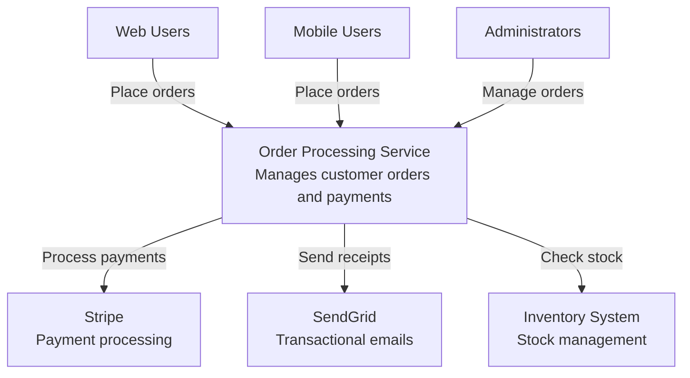
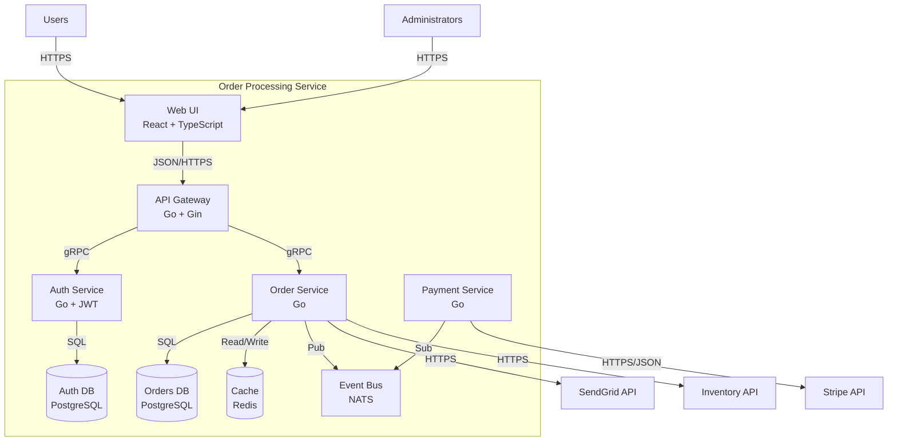
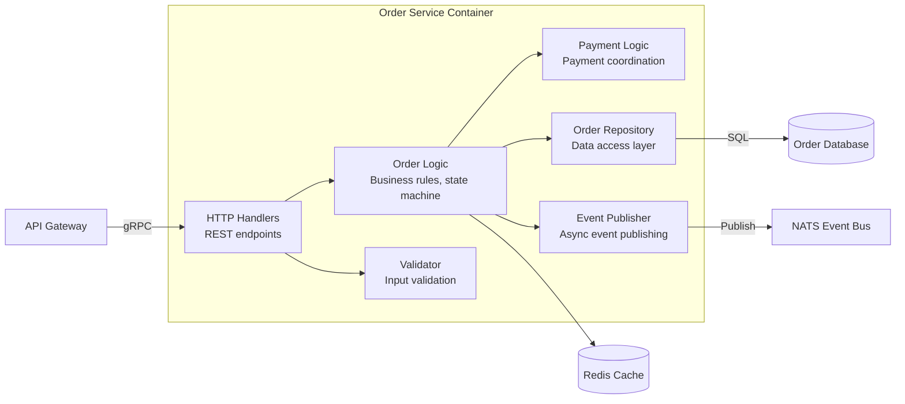
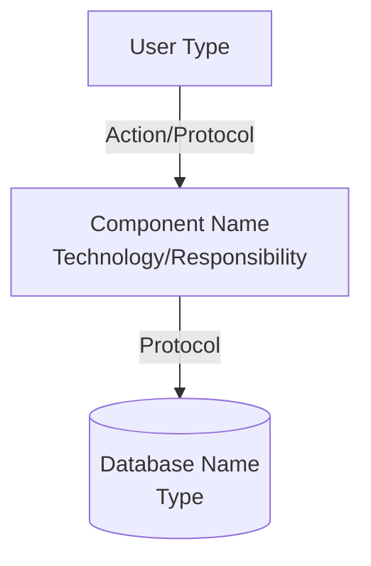
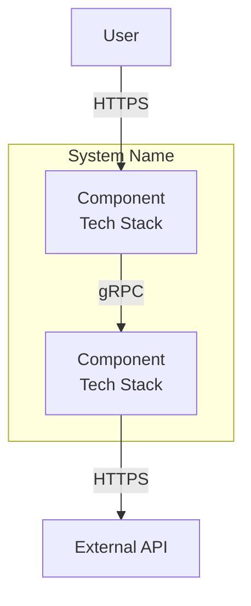

# C4 Model Diagrams Guidance

Generate C4 architecture diagrams using the hierarchical 4-level model: Context, Containers, Components, and Code. C4 provides standardized visualization of software architecture at different abstraction levels.

## Scope Rules

**CREATE C4 DIAGRAMS WHEN:**
- Starting new service (create Levels 1-3)
- Adding major components (update relevant levels)
- Documenting architecture (complement Arc42)
- Onboarding requires visual aids

**UPDATE C4 DIAGRAMS WHEN:**
- New services/containers added or removed
- External integrations change
- Component structure evolves
- Technology stack changes

**DO NOT CREATE:**
- Level 4 (Code) diagrams by default - code is sufficient documentation
- All 4 levels for simple services without justification

## Prohibitions

- Never mix abstraction levels in single diagram
- Never create Level 4 without explicit justification
- Never show internal components at Level 1
- Never omit technology stack from Level 2 containers
- Never include implementation details at Levels 1-2
- Never exceed 10 boxes at Level 1
- Never exceed 12 components at Level 3
- Never omit edge labels (protocols, actions)
- Refuse requests to create all 4 levels for simple services

## File Structure

Store C4 diagrams in:
```
.sow/knowledge/architecture/diagrams/
```

**Naming convention**:
- Level 1: `c4-context.mmd`
- Level 2: `c4-container.mmd`
- Level 3: `c4-component-[container-name].mmd`

Examples:
- `c4-context.mmd`
- `c4-container.mmd`
- `c4-component-order-service.mmd`
- `c4-component-auth-service.mmd`

## Level Reference

### Level 1: System Context
**Purpose**: System boundary and environment
**Audience**: Technical and non-technical stakeholders
**Shows**: System (single box), users/actors, external systems
**Hides**: Internal structure, technology choices, implementation details
**Requirements**: Plain language, edge labels, 5-10 boxes maximum, system visually distinct
**File name**: `c4-context.mmd`

### Level 2: Container
**Purpose**: High-level technology choices and communication
**Audience**: Technical team members
**Shows**: Deployable units (services, databases, message queues), technology stack per container, communication protocols
**Hides**: Internal component structure, code-level details
**Requirements**: All deployable units shown, technology stack labeled, protocols on edges, subgraphs for grouping
**Note**: "Container" means deployable unit, not necessarily Docker container
**File name**: `c4-container.mmd`

### Level 3: Component
**Purpose**: Internal structure of a container
**Audience**: Developers working on this container
**Shows**: Components within single container, component responsibilities, component interactions
**Hides**: Code-level details (classes, methods), implementation specifics
**Requirements**: One diagram per container, logical groupings (layers, responsibilities), component responsibilities labeled, data flow direction clear, maximum 10-12 components
**File name**: `c4-component-[container-name].mmd`

### Level 4: Code (Rarely Used)
**Purpose**: Class-level structure (UML)
**Audience**: Developers implementing code
**When to create**: Never by default. Only create if complex domain model requires it, team explicitly requests it, or onboarding demands it
**Guidance**: Skip this level. Code serves as documentation at this level.

## Integration with Arc42

| Arc42 Section | C4 Level | Connection |
|---------------|----------|------------|
| Section 3: Context and Scope | Level 1 (Context) | System boundary and external dependencies |
| Section 5: Building Block View | Level 2 (Containers), Level 3 (Components) | System structure at different levels |
| Section 6: Runtime View | Sequence diagrams | How containers/components interact over time |

Reference C4 diagrams from Arc42 sections:
```markdown
# 5. Building Block View

## Level 1: System Overview

See [C4 Container Diagram](../diagrams/c4-container.mmd) for visual representation.

[Text description of containers...]
```

## Comprehensive Example: Order Processing System

### Level 1: System Context



### Level 2: Container Diagram



### Level 3: Component Diagram (Order Service)



## Requirements by Level

### Level 1 Requirements
- Represent system as single box
- Include all user types
- Show all external systems
- Use plain language, no technical jargon
- Label edges with actions/purposes
- Limit to 5-10 boxes
- Make system visually distinct from external entities

### Level 2 Requirements
- Show all deployable units
- Include technology stack for each container (language, framework, database type)
- Show databases, message queues, caches
- Label communication protocols on edges
- Use subgraphs to group related containers
- Use database cylinder notation: `[(Database Name<br/>Type)]`
- Never show code-level components

### Level 3 Requirements
- Focus on one container per diagram
- Show logical components (not classes or files)
- Include component responsibilities in labels
- Show data flow direction clearly
- Limit to 10-12 components maximum
- Group by layer or responsibility
- Show external dependencies from Level 2

## Mermaid Syntax Essentials

### Basic Structure


### Subgraphs for Grouping


### Common Notations
- Rectangle: `[Component Name<br/>Details]`
- Database: `[(Database Name<br/>Type)]`
- Rounded: `(Component Name)`
- Edge label: `-->|Label text| Target`
- Comment: `%% Comment text`

## File Registration

```bash
# Level 1: Context diagram
sow design add-output c4-context.mmd \
  --description "C4 Level 1: System context" \
  --target .sow/knowledge/architecture/diagrams/ \
  --type c4-context

# Level 2: Container diagram
sow design add-output c4-container.mmd \
  --description "C4 Level 2: Containers and technology" \
  --target .sow/knowledge/architecture/diagrams/ \
  --type c4-container

# Level 3: Component diagram
sow design add-output c4-component-order-service.mmd \
  --description "C4 Level 3: Order service components" \
  --target .sow/knowledge/architecture/diagrams/ \
  --type c4-component
```

## Validation Checklist

### Level 1 (Context) Validation
- [ ] System shown as single box
- [ ] All user types included
- [ ] All external systems shown
- [ ] Plain language, no technical jargon
- [ ] All edges labeled with actions
- [ ] 5-10 boxes maximum
- [ ] No internal structure visible
- [ ] Saved as `c4-context.mmd`

### Level 2 (Container) Validation
- [ ] All deployable units shown
- [ ] Technology stack labeled for each container
- [ ] Databases and message queues included
- [ ] Communication protocols labeled on edges
- [ ] Subgraphs used for grouping
- [ ] No code-level components shown
- [ ] No implementation details included
- [ ] Saved as `c4-container.mmd`

### Level 3 (Component) Validation
- [ ] Focuses on single container
- [ ] Shows logical components, not classes
- [ ] Component responsibilities labeled
- [ ] Data flow direction clear
- [ ] Maximum 10-12 components
- [ ] No code-level details (classes, methods)
- [ ] External dependencies from Level 2 shown
- [ ] Saved as `c4-component-[container-name].mmd`

### Cross-Level Validation
- [ ] Consistent abstraction level throughout diagram
- [ ] No mixing of levels (e.g., components in container diagram)
- [ ] Names consistent across levels
- [ ] External systems from Level 1 match Level 2 external connections
- [ ] Level 3 components aggregate to Level 2 containers
