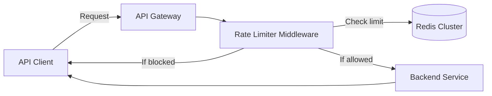

# Design Document Guidance

Generate technical design documents using templates based on feature complexity. Design docs describe implementation approach ("how to build"), while ADRs document architectural decisions ("what was decided and why").

## Scope Rules

**CREATE DESIGN DOC FOR:**
- Features with moderate complexity requiring thought before implementation
- Components benefiting from documented approach
- Work requiring coordination across multiple areas
- Designs to be preserved for historical reference and breakdown sessions

**DO NOT CREATE DESIGN DOC FOR:**
- Architectural decisions (use ADRs instead)
- Trivial features implementable in hours
- Work already covered by existing design docs

**KEY DISTINCTION**: Design docs are implementation-focused. If documenting a decision that changes architecture, create an ADR instead.

## Prohibitions

- Never include implementation code (class definitions, method bodies)
- Never create comprehensive docs for simple features
- Never create design docs for architectural decisions (use ADRs)
- Never omit alternatives section (minimum 2 alternatives required)
- Never write design docs as implementation tutorials
- Never exceed 8 pages without splitting into multiple docs
- Refuse requests for wrong template size relative to feature complexity

## Size Selection Guide

| Size | Length | Word Count | Use For |
|------|--------|------------|---------|
| **Mini** | 1-2 pages | 500-1000 words | Simple features, straightforward implementations, well-understood problems |
| **Standard** | 3-5 pages | 1500-2500 words | Moderate features with multiple components, new subsystems, cross-area coordination |
| **Comprehensive** | 6-8 pages | 3000-4000 words | Major features, novel approaches, multi-phase implementations, high-complexity integrations |

Never exceed 8 pages. If design requires more, split into multiple docs or reconsider scope.

## Template Structure by Size

### Mini Design Doc Sections
1. **Overview**: State what is being built and why it matters (1-2 paragraphs)
2. **Goals/Non-Goals**: Specific measurable goals, explicitly list out-of-scope items
3. **Design**: Explain approach with key components and data flow (3-5 paragraphs or simple diagram)
4. **API/Interface**: Key method signatures or endpoint definitions (if applicable)
5. **Implementation Notes**: Important technical details, limitations, constraints
6. **Testing Approach**: How it will be tested, key scenarios
7. **Alternatives Considered**: Minimum 2 alternatives with reasons for rejection

### Standard Design Doc Sections
Include all Mini sections, expanded with:
- **Background**: Current state (2-3 paragraphs), requirements (functional and non-functional)
- **Architecture Overview**: Diagram with 2-3 paragraph explanation
- **Component Breakdown**: Each component with responsibilities, behaviors, dependencies
- **Data Models**: Key entities and relationships with schema/diagram
- **APIs/Interfaces**: External interfaces exposed or consumed (purpose, input, output, behavior)
- **Data Flow**: How data moves through system for key scenarios (sequence diagram or steps)
- **Error Handling**: Error scenarios and handling approaches
- **Security/Privacy Considerations**: Security model, data privacy, auth
- **Performance Considerations**: Performance requirements, scaling, bottlenecks
- **Open Questions**: Unresolved issues needing discussion (checklist format)
- **References**: Links to explorations, ADRs, external docs
- **Future Considerations**: Known limitations, out-of-scope enhancements

### Comprehensive Design Doc Sections
Include all Standard sections, expanded with:
- **Executive Summary**: 3-4 sentences readable by non-technical stakeholders (add to beginning)
- **Success Metrics**: Measurable metrics for success (add to Goals section)
- **Motivation**: Why change is needed, what problem is being solved (add to Background)
- **Constraints**: Technical and business constraints (add to Background)
- **State Management**: How state is managed, consistency model (add to Design)
- **Cross-Cutting Concerns**: Logging/monitoring, security, performance, scalability (separate section)
- **Implementation Plan**: Phased approach with deliverables, timeline, dependencies per phase
- **Migration/Rollout Strategy**: Migration plan, phased rollout, rollback plan (if replacing existing system)
- **Monitoring and Observability**: Metrics to track, alerts, dashboards
- **Disaster Recovery**: Failure handling, backup/restore procedures
- **Cost Analysis**: Infrastructure costs, operational costs (if applicable)
- **Appendix**: Supporting details, detailed diagrams, code snippets

## Integration with Other Documents

**Design Doc + ADR**:
- ADR documents architectural decision (e.g., "Use event sourcing")
- Design doc shows implementation (e.g., "How order processing implements event sourcing")
- Cross-reference both directions
- Example: `adr-023-event-sourcing.md` ↔ `order-processing-design.md` (references ADR-023)

**Design Doc + Arc42**:
- After finalizing design doc, update relevant Arc42 sections
- Link Arc42 to design doc for implementation details
- Example: Add component to Arc42 Section 5, reference design doc

**Design Doc + Breakdown**:
- Breakdown sessions read design doc
- Create implementation tasks based on design phases
- Each task references specific design doc sections

## Example: Standard Design Doc

```markdown
# Rate Limiting System Design

**Author**: Engineering Team
**Date**: 2025-01-27
**Status**: Approved
**Reviewers**: Tech Lead, Security Lead

## Overview

Implement a distributed rate limiting system to protect API endpoints from abuse and ensure fair resource allocation across users. The system will enforce per-user and per-endpoint rate limits using a token bucket algorithm with Redis as the backing store.

Current state: No rate limiting exists. Recent traffic spikes have caused service degradation. This design implements configurable rate limits to prevent resource exhaustion while maintaining good user experience for legitimate traffic.

## Goals and Non-Goals

**Goals**:
- Enforce per-user rate limits (e.g., 100 requests/minute per user)
- Support per-endpoint rate limits (e.g., expensive operations limited to 10 requests/minute)
- Achieve < 5ms p95 latency overhead for rate limit checks
- Enable dynamic limit configuration without code changes

**Non-Goals** (explicitly out of scope):
- IP-based rate limiting (future consideration)
- Geographic-based limiting
- Cost-based rate limiting (different limits per pricing tier)

## Background

### Current State

API endpoints have no rate limiting. All authenticated users can make unlimited requests. During traffic spikes (Oct 2024), API response times degraded from 50ms to 2s p95, affecting all users.

### Requirements

**Functional Requirements**:
- FR1: Enforce configurable per-user rate limits
- FR2: Enforce configurable per-endpoint rate limits
- FR3: Support multiple rate limit windows (per-second, per-minute, per-hour)
- FR4: Return clear error messages when limits exceeded

**Non-Functional Requirements**:
- NFR1: Rate limit check latency < 5ms p95
- NFR2: No single point of failure
- NFR3: Graceful degradation if Redis unavailable (fail open)

## Design

### Architecture Overview



Rate limiting implemented as middleware in API Gateway. Token bucket algorithm tracks request counts in Redis. Each request checks and decrements available tokens. If tokens available, request proceeds. If exhausted, return 429 Too Many Requests.

### Component Breakdown

#### Rate Limiter Middleware

**Responsibility**: Intercept requests, check rate limits, enforce limits

**Key Behaviors**:
- Extract user ID and endpoint from request
- Query Redis for current token count
- Decrement token if available, allow request
- Return 429 if no tokens available
- Include rate limit headers in response (X-RateLimit-Limit, X-RateLimit-Remaining, X-RateLimit-Reset)

**Dependencies**: Redis client, configuration service

#### Token Bucket Manager

**Responsibility**: Implement token bucket algorithm logic

**Key Behaviors**:
- Calculate tokens to add based on elapsed time
- Atomic check-and-decrement operation
- Handle bucket initialization
- Support multiple time windows

**Dependencies**: Redis atomic operations

#### Configuration Service

**Responsibility**: Provide rate limit configuration per user/endpoint

**Key Behaviors**:
- Load rate limit rules from configuration store
- Cache rules in memory (5-minute TTL)
- Support rule updates without restart

**Dependencies**: Configuration database

### Data Models

**Redis Key Structure**:
```
rate_limit:{user_id}:{endpoint}:{window}
Example: rate_limit:user123:/api/orders:minute
```

**Redis Value**:
```json
{
  "tokens": 95,
  "last_refill": 1706380800,
  "capacity": 100,
  "refill_rate": 100
}
```

**Configuration Schema**:
```json
{
  "endpoint": "/api/orders",
  "limits": [
    {"window": "minute", "capacity": 100, "refill_rate": 100},
    {"window": "hour", "capacity": 1000, "refill_rate": 1000}
  ]
}
```

### Data Flow

**Request Flow**:
1. Client sends request to API Gateway
2. Rate Limiter Middleware extracts user ID and endpoint
3. Token Bucket Manager queries Redis for token count
4. If tokens available:
   - Decrement token count atomically
   - Add rate limit headers to response
   - Forward request to backend service
5. If tokens exhausted:
   - Return 429 status with Retry-After header
   - Log rate limit event

**Token Refill**:
- Tokens refill continuously based on elapsed time
- Calculation: `tokens = min(capacity, current_tokens + (elapsed_seconds * refill_rate))`
- Refill happens during check operation (no background job needed)

## Error Handling

- **Redis unavailable**: Fail open (allow requests), log errors, alert on-call
- **Configuration load failure**: Use last known good configuration, alert
- **Invalid user ID**: Reject request with 401 Unauthorized
- **Rate limit exceeded**: Return 429 with JSON error body and Retry-After header

## Security/Privacy Considerations

**Authentication**: Rate limiting occurs after authentication. User ID extracted from validated JWT token.

**Data Privacy**: Rate limit counters contain only user ID and request counts (no sensitive data).

**Denial of Service**: Rate limiting itself mitigates DoS. Redis cluster provides redundancy. Circuit breaker prevents Redis overload.

## Performance Considerations

**Latency**: Redis query adds < 2ms p50, < 5ms p95 (measured in staging).

**Redis Load**: 10,000 req/sec = 10,000 Redis ops/sec. Redis cluster handles 100,000+ ops/sec.

**Bottlenecks**: Redis network round-trip is primary overhead. Mitigate with connection pooling and pipelining.

## Testing Strategy

**Unit Tests**:
- Token bucket algorithm correctness
- Configuration parsing
- Error handling paths

**Integration Tests**:
- Rate limit enforcement (exceed limit, verify 429)
- Token refill behavior
- Redis failure handling (fail open)
- Multiple time windows

**Load Tests**:
- 10,000 req/sec sustained load
- Measure rate limiter latency overhead
- Verify Redis cluster performance

## Alternatives Considered

### Option 1: In-Memory Rate Limiting

**Description**: Store rate limit counters in API Gateway memory instead of Redis.

**Pros**:
- Lower latency (no network call)
- Simpler implementation
- No Redis dependency

**Cons**:
- No coordination across API Gateway instances
- User can bypass limits by hitting different instances
- Lost counters on restart

**Why not chosen**: Multi-instance deployment requires distributed state. Cannot guarantee rate limits without coordination.

### Option 2: Database-Based Rate Limiting

**Description**: Store rate limit counters in PostgreSQL.

**Pros**:
- Persistent storage
- Transactional consistency
- Existing infrastructure

**Cons**:
- Higher latency (10-20ms for database query)
- Database becomes bottleneck
- Adds load to primary database

**Why not chosen**: Database latency exceeds < 5ms requirement. Rate limiting should not impact database used for business data.

## Open Questions

- [x] Redis cluster sizing for production load (resolved: 3 nodes sufficient)
- [ ] Monitoring dashboard design needs finalization
- [ ] Cost-based rate limiting for future pricing tiers

## References

- [ADR-018: Token Bucket Algorithm](../adrs/adr-018-token-bucket.md)
- [Redis Rate Limiting Patterns](https://redis.io/docs/manual/patterns/rate-limiter/)
- [Exploration: Rate Limiting Options](../explorations/rate-limiting-research.md)

## Future Considerations

- IP-based rate limiting for unauthenticated endpoints
- Geographic-based limiting for compliance
- Tiered rate limits based on user pricing plan
- Rate limit analytics dashboard
```

## Requirements

**Lead with decisions**: State the approach first, then justify. Do not make reader deduce what is being proposed.

**Specificity**: Include specific technologies, concrete numbers, measurable outcomes. Replace "improve performance" with "reduce query time by 70%". Replace "use caching" with "cache in Redis with 1-hour TTL".

**Diagrams**: Include one diagram per concept. Label all elements. Use component diagrams, sequence diagrams, state diagrams, or ER diagrams. Avoid massive diagrams showing everything.

**Alternatives**: Present alternatives fairly with real advantages and disadvantages. Explain specific reasons for rejection. Minimum 2 alternatives required.

**Complexity**: If genuinely complex, explain why complexity is necessary, show alternatives considered, break into understandable pieces. Do not oversimplify.

**Context**: Always explain why before what. Start with problem and impact before proposing solution.

## File Conventions

**Storage location**: `.sow/knowledge/designs/`

**File naming**:
- Format: `feature-name-design.md` or `component-name-design.md`
- Use kebab-case (hyphens)
- Keep concise (3-5 words)
- Examples: `rate-limiting-design.md`, `oauth-integration-design.md`, `document-parsing-design.md`

**Registration**:
```bash
sow design add-output feature-name-design.md \
  --description "Design for [feature]" \
  --target .sow/knowledge/designs/ \
  --type design
```

## Validation Checklist

**All sizes**:
- [ ] Overview clearly states what is being built
- [ ] Goals are specific and measurable
- [ ] Non-goals explicitly listed
- [ ] Design approach clearly described
- [ ] Key components identified
- [ ] Data flow explained (diagram or description)
- [ ] Minimum 2 alternatives documented with rejection reasons
- [ ] Testing approach described
- [ ] Length matches complexity (mini 1-2 pages, standard 3-5, comprehensive 6-8)

**Standard and Comprehensive only**:
- [ ] Diagrams are clear and labeled
- [ ] Background section explains current state
- [ ] Error handling strategy documented
- [ ] References to ADRs and exploration findings included

**Comprehensive only**:
- [ ] Executive summary included (readable by non-technical)
- [ ] Success metrics defined
- [ ] Implementation plan with phases
- [ ] Migration/rollout strategy (if applicable)
- [ ] Monitoring and observability plan

**Content quality**:
- [ ] No implementation code included
- [ ] Not written as implementation tutorial
- [ ] Specific technologies and numbers included
- [ ] Alternatives presented fairly
- [ ] Context (why) provided before solution (what)
