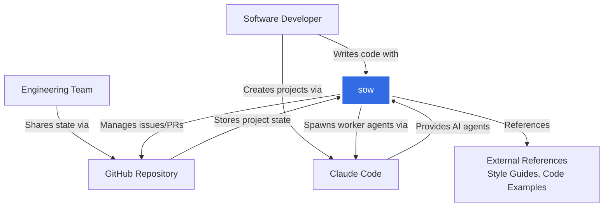
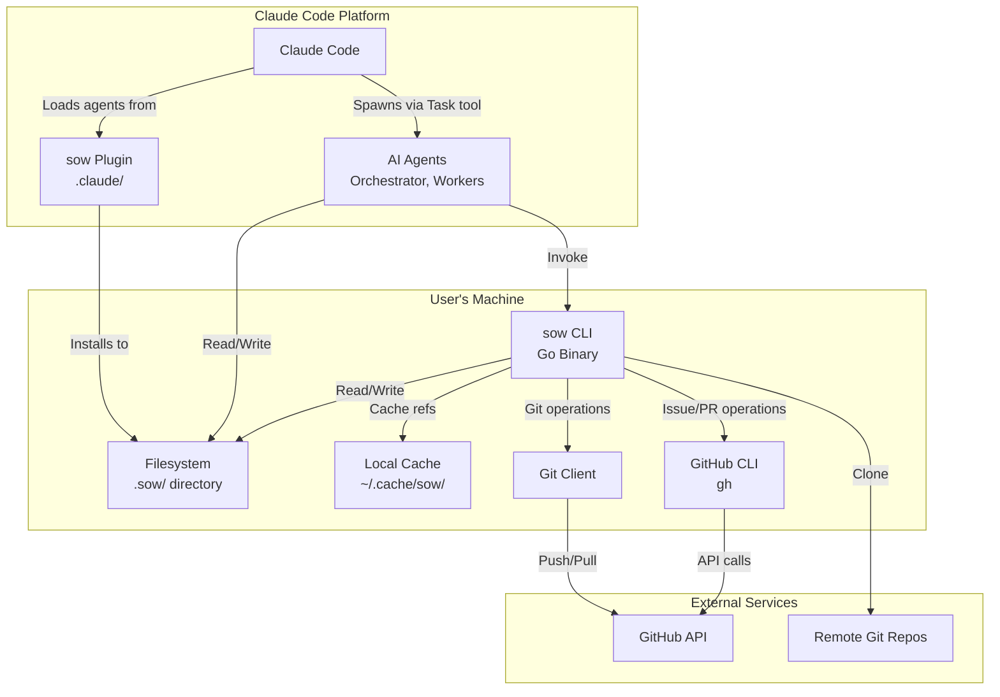

# 3. System Context and Scope

## Business Context

### External Entities

| Entity                  | Role                                                                        | Interface                                     |
| ----------------------- | --------------------------------------------------------------------------- | --------------------------------------------- |
| **Software Developer**  | Primary user who initiates projects, provides feedback, reviews work        | CLI commands, Claude Code chat                |
| **Engineering Team**    | Collaborators who share project state, review PRs                           | Git branches, GitHub PRs                      |
| **GitHub Repository**   | Version control system storing code and `.sow/` state                       | Git protocol, gh CLI                          |
| **Claude Code**         | AI agent platform providing orchestrator and worker agents                  | Task tool for agent spawning, file operations |
| **External References** | Remote git repositories containing style guides, conventions, code examples | Git clone, symlinks                           |

## Technical Context

## Interfaces Specification

### CLI ↔ Filesystem
- **Technology**: Billy filesystem abstraction (cross-platform)
- **Authentication**: Filesystem permissions (no explicit auth)
- **Data Format**: YAML (state files), Markdown (logs, docs), JSON (refs index)
- **Operations**: Read, Write, Chroot (scope to `.sow/`), Atomic rename for consistency

### CLI ↔ Git
- **Technology**: go-git library (pure Go git implementation)
- **Authentication**: Inherits from user's git config
- **Data Format**: Git objects (commits, trees, blobs)
- **Operations**: Branch detection, status checks, reference management

### CLI ↔ GitHub CLI (gh)
- **Technology**: Shell execution of gh binary
- **Authentication**: gh auth (OAuth, SSH, or token)
- **Data Format**: JSON output from gh commands
- **Operations**: Issue CRUD, PR creation, branch linking (`gh issue develop`)

### Claude Code ↔ sow CLI
- **Technology**: Bash tool in Claude Code (shell command execution)
- **Authentication**: None (local command)
- **Data Format**: Structured output (YAML, JSON, text)
- **Operations**: `sow log`, `sow project`, `sow design`, `sow refs`, etc.

### Claude Code ↔ AI Agents
- **Technology**: Task tool (spawns new agent contexts)
- **Authentication**: None (platform internal)
- **Data Format**: Prompt text (markdown) + file reads
- **Operations**: Spawn worker with bounded context, receive completion report

### CLI ↔ External References
- **Technology**: Git clone to local cache
- **Authentication**: Git credentials (HTTPS/SSH)
- **Data Format**: Git repositories
- **Operations**: Clone once, symlink to `.sow/refs/`, periodic updates

## System Boundary

### Inside System Boundary
- CLI binary (Go application)
- State files in `.sow/` directory
- Local cache in `~/.cache/sow/`
- CUE schemas embedded in CLI
- Prompt templates embedded in CLI
- Plugin files in `.claude/` (execution layer)

### Outside System Boundary
- Claude Code platform (external dependency)
- AI models (Claude Sonnet, Haiku, etc.)
- GitHub API and repositories
- Git repositories (local and remote)
- External reference repositories
- User's filesystem and shell environment
- GitHub CLI (gh) binary

### Data Flow Across Boundary
**Inbound**:
- User commands via CLI
- Git repository metadata (branches, commits)
- GitHub issue/PR data via gh CLI
- External reference content via git clone
- AI agent responses via Claude Code

**Outbound**:
- State file writes to `.sow/`
- Git operations (branch creation, commits)
- GitHub operations (issues, PRs) via gh
- Prompts and context to Claude Code agents
- Cache writes to `~/.cache/sow/`
