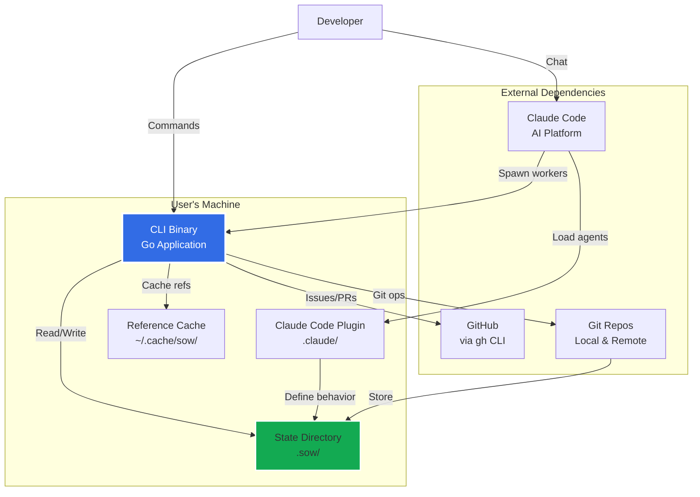
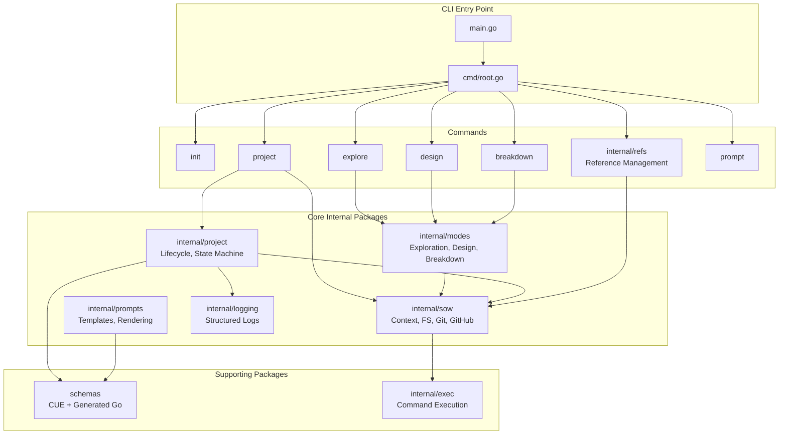
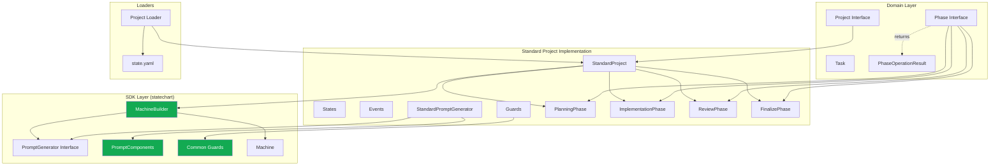
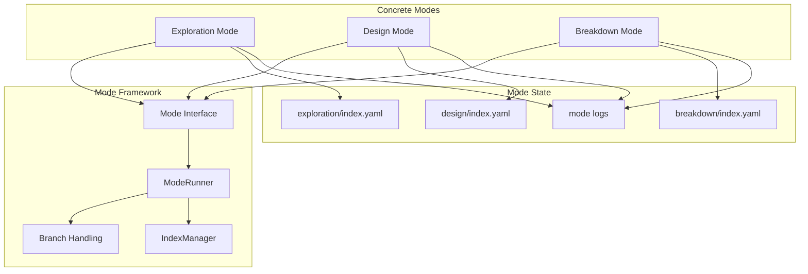
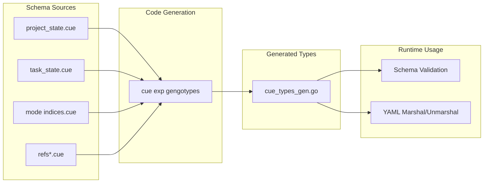

# 5. Building Block View

## Level 1: System Overview

### Components

**CLI Binary** (`cli/`)
- Main entry point for all sow operations
- Command routing via Cobra framework
- Context initialization (FS, Git, GitHub clients)
- Schema validation via embedded CUE types
- Prompt rendering for Claude Code agents

**Claude Code Plugin** (`plugin/` → `.claude/`)
- Agent definitions (orchestrator, workers)
- Slash commands for user interaction
- Hooks for lifecycle events
- Distributed via Claude Code marketplace
- Thin wrapper around CLI commands

**State Directory** (`.sow/`)
- Project state and lifecycle management
- Mode sessions (exploration, design, breakdown)
- Knowledge base (ADRs, architecture docs)
- References index (external style guides, code)
- Git-versioned (project state on feature branches)

**Reference Cache** (`~/.cache/sow/`)
- Cloned external git repositories
- Shared across all local projects
- Symlinked into `.sow/refs/` per project
- Reduces disk usage and clone operations

---

## Level 2: CLI Internals

### Core Components

**Command Layer** (`cmd/`)
- Entry point commands: `init`, `start`, `project`, `explore`, `design`, `breakdown`, `prompt`
- Management subcommands: `exploration/`, `design/`, `issue/`, `refs/`, `agent/`
- Context injection via Cobra's PreRunE hook
- Command-line flag parsing and validation
- User-facing error messages

**Context Package** (`internal/sow/`)
- Unified access to FS, Git, GitHub clients
- Repository root detection
- Initialization check (`.sow/` exists?)
- Config loading from `.sow/config.yaml`
- Validation infrastructure

**Project Package** (`internal/project/`)
- Domain layer: `Project`, `Phase`, `Task` interfaces
- Standard project implementation (5-phase lifecycle)
- State machine for phase transitions (`statechart/`)
- Loader for deserializing state from disk
- Task management and status tracking

**Modes Package** (`internal/modes/`)
- Unified framework for exploration, design, breakdown modes
- Shared branch management logic
- Index management (generic for all modes)
- Prompt generation patterns
- Session lifecycle (init, resume, finalize)

**Prompts Package** (`internal/prompts/`)
- Template registry (embedded markdown templates)
- Context types for each prompt scenario
- Rendering via Go's text/template
- Statechart prompts (per phase)
- Mode prompts (exploration, design, breakdown)
- Greeting system

**Schemas Package** (`schemas/`)
- CUE schema definitions (`.cue` files)
- Auto-generated Go types (`cue_types_gen.go`)
- Project state, task state, mode indices
- Validation functions
- Schema versioning

**Logging Package** (`internal/logging/`)
- Structured log entry format (YAML frontmatter + markdown body)
- Append operations for project/task/mode logs
- Agent ID construction (role + iteration)
- Filesystem abstraction for testability

---

## Level 3: Project System Internals

### Sub-components

**Domain Layer** (`internal/project/domain/`)
- `Project` interface: Core aggregate root
- `Phase` interface: Generic phase operations (artifacts, tasks, lifecycle)
- `Task` concrete type: Implementation tasks with status, iteration, feedback
- `PhaseOperationResult`: Return type for operations that may trigger state machine events
- Option patterns for configuration (ArtifactOption, TaskOption, PhaseOption)

**SDK Layer** (`internal/project/statechart/`)

The SDK provides reusable infrastructure that all project types share:

- `MachineBuilder`: Fluent API for constructing state machines with options pattern
- `PromptGenerator` (interface): Contract for project-owned prompt generation
- `PromptComponents`: Reusable prompt building blocks (git status, headers, task summaries, template rendering)
- Common Guards: Shared predicates (`TasksComplete`, `ArtifactsApproved`, `MinTaskCount`, `HasArtifactWithType`)
- `Machine`: State machine wrapper with filesystem persistence
- `PhaseOperationResult` support: Enables declarative event triggering from CLI operations

**Standard Project** (`internal/project/standard/`)

Implements 5-phase lifecycle using SDK components:

- **Project struct**: Owns state machine instance, implements `Project` interface
- **States** (`states.go`): `PlanningActive`, `ImplementationPlanning`, `ImplementationExecuting`, `ReviewActive`, `FinalizeDocumentation`, `FinalizeChecks`, `FinalizeDelete`
- **Events** (`events.go`): `EventProjectInit`, `EventCompletePlanning`, `EventTasksApproved`, `EventAllTasksComplete`, etc.
- **Guards** (`guards.go`): Standard-specific guard functions (`PlanningComplete`, `TasksApproved`, etc.)
- **Prompt Generator** (`prompts.go`): Implements `PromptGenerator` interface, generates state-specific prompts
- **Phase implementations**: PlanningPhase, ImplementationPhase, ReviewPhase, FinalizePhase
- **State machine construction**: Uses `MachineBuilder` to wire states, events, guards, and transitions
- YAML marshaling (with null value removal)
- Pull request creation

**Loader** (`internal/project/loader/`)
- Deserializes `state.yaml` into project type (e.g., `StandardProject`)
- Type detection based on `project.type` field
- Validates schema via CUE types
- Reconstructs state machine at correct state using builder
- Handles missing files gracefully
- Extensible for multiple project types

---

## Level 3: Modes System Internals

### Sub-components

**Mode Interface** (`internal/modes/types.go`)
- Common contract for all modes
- Branch prefix (`explore/`, `design/`, `breakdown/`)
- Directory name under `.sow/`
- Index path
- Valid statuses
- Prompt ID

**Mode Runner** (`internal/modes/runner.go`)
- Generic execution logic for all modes
- Branch scenario handling (--branch flag vs. current branch)
- Session initialization (new vs. resume)
- Prompt generation
- Message formatting

**Index Manager** (`internal/modes/index.go`)
- Generic type-safe index management
- Load/Save/Init/Delete operations
- Existence checks
- File path resolution
- Works with any schema type

**Exploration Mode** (`internal/exploration/`)
- Research and discovery sessions
- Tracks topics, journal entries, files
- Supports iterative research workflow
- Creates summaries in knowledge base

**Design Mode** (`internal/design/`)
- Formal documentation creation
- Tracks inputs (sources) and outputs (documents)
- Manages document target locations
- Produces ADRs, Arc42 sections, design docs, C4 diagrams

**Breakdown Mode** (`internal/breakdown/`)
- Decomposes designs into work units
- Tracks work unit status: proposed → document_created → approved → published
- Publishes work units as GitHub issues
- Manages dependencies between work units

---

## Level 3: Schema System

### Schema Files

**Project State** (`project_state.cue`, `projects/*.cue`)
- Project metadata (name, branch, description)
- Statechart state tracking
- Phase configurations (enabled, status, timestamps)
- GitHub issue linkage

**Task State** (`task_state.cue`)
- Task metadata (ID, name, status)
- Iteration counter (for worker respawning)
- References (knowledge, refs, code files)
- Files modified list
- Feedback tracking

**Mode Indices** (`exploration_index.cue`, `design_index.cue`, `breakdown_index.cue`)
- Session metadata (topic, branch, status, timestamps)
- Exploration: Topics, journal entries, files
- Design: Inputs and outputs with target locations
- Breakdown: Inputs and work units with GitHub linkage

**References** (`refs_*.cue`)
- Committed index: URL, type (knowledge/code), subpath, description, tags
- Cache index: SHA, last fetched timestamp, cache path
- Local index: User-specific refs not shared with team

---

## Component Dependencies

### Primary Dependencies
- **Commands** depend on **Core Internal Packages**
- **Core Internal Packages** depend on **Schemas**
- **Project Package** depends on **Sow Package** (Context, FS, Git)
- **Modes Package** depends on **Sow Package**
- **All packages** depend on **Schemas** for type safety

### External Dependencies
- Billy (filesystem abstraction)
- Cobra (CLI framework)
- stateless (state machine)
- go-git (git operations)
- CUE (schema validation)
- text/template (prompt rendering)

### Dependency Rules
- No circular dependencies between internal packages
- External dependencies minimized (Go stdlib preferred)
- Test dependencies isolated to `_test.go` files
- Schema generation at build time (not runtime)
