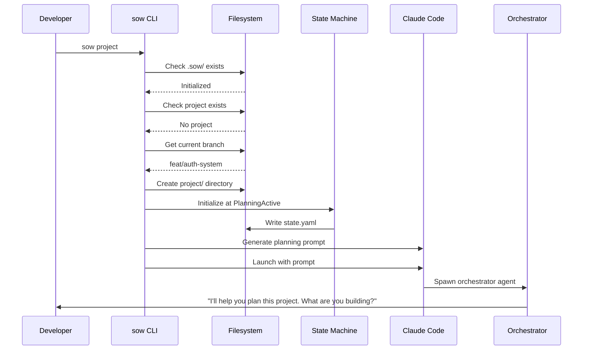
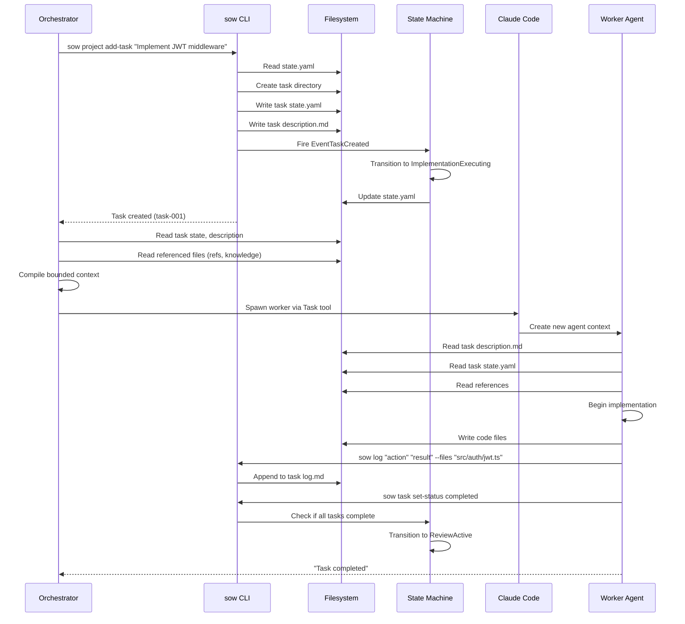
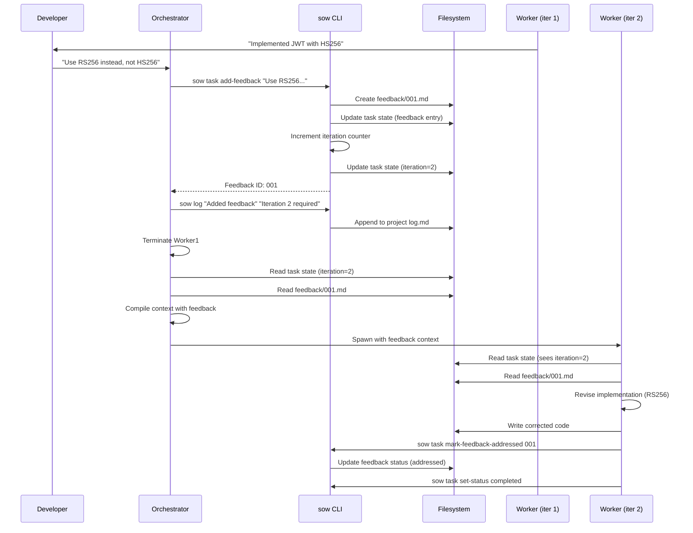
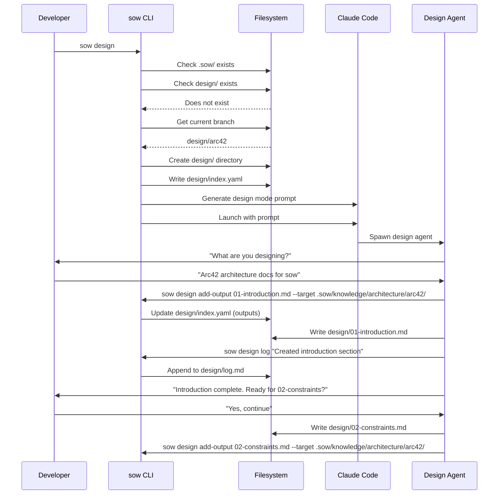
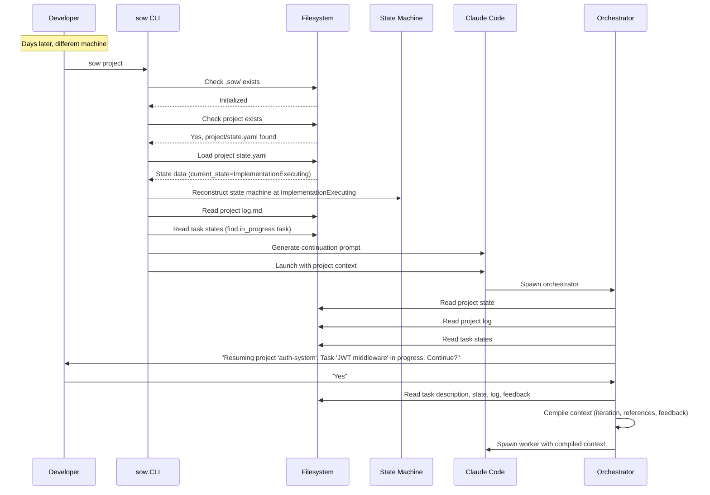
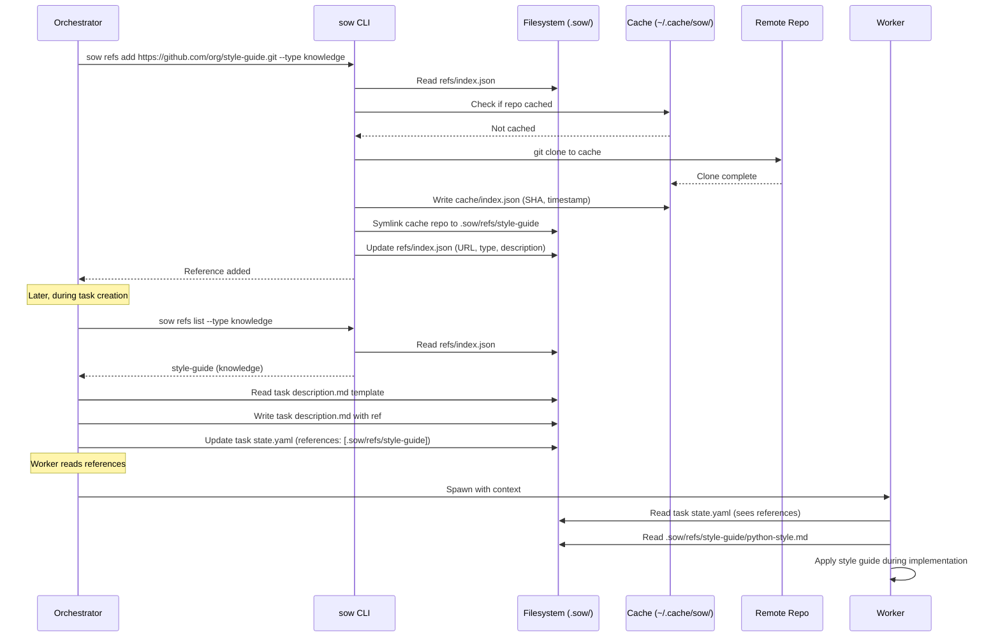

# 6. Runtime View

## Scenario 1: New Project Initialization

**Trigger**: Developer runs `sow project` on a feature branch

**Steps**:
1. CLI validates `.sow/` exists (run `sow init` if not)
2. CLI checks if project already exists (error if so)
3. CLI validates not on protected branch (main/master)
4. CLI creates `.sow/project/` directory structure
5. CLI initializes state machine at `PlanningActive`
6. CLI writes initial `state.yaml` with project metadata
7. CLI generates planning phase prompt via prompts package
8. CLI launches Claude Code with compiled prompt
9. Orchestrator agent spawned by Claude Code platform
10. Orchestrator begins conversational planning with developer

**Data Written**:
- `.sow/project/state.yaml`: Project metadata, empty phase configurations
- `.sow/project/log.md`: Initial log entry (project created)
- `.sow/project/context/`: Empty directory for decisions

---

## Scenario 2: Task Execution (Worker Spawning)

**Trigger**: Orchestrator completes planning, begins implementation

**Steps**:
1. Orchestrator invokes CLI to create task
2. CLI creates task directory: `.sow/project/phases/implementation/tasks/task-001/`
3. CLI writes task `state.yaml` with metadata (iteration=1, status=pending)
4. CLI writes task `description.md` with requirements
5. CLI fires state machine event `EventTaskCreated`
6. State machine transitions to `ImplementationExecuting` (if first task)
7. CLI updates project `state.yaml` with new state
8. Orchestrator reads task state and description
9. Orchestrator reads referenced files (refs, knowledge, planning artifacts)
10. Orchestrator compiles bounded context for worker
11. Orchestrator spawns worker via Claude Code Task tool
12. Worker receives compiled prompt with task context
13. Worker reads task files from filesystem
14. Worker executes implementation (writes code)
15. Worker logs actions via CLI commands (`sow log`)
16. Worker updates task status via CLI (`sow task set-status completed`)
17. CLI checks if all tasks complete, fires state machine event if so
18. State machine transitions to `ReviewActive`
19. Worker reports completion back to orchestrator

**Data Written**:
- `.sow/project/phases/implementation/tasks/task-001/state.yaml`: Task metadata
- `.sow/project/phases/implementation/tasks/task-001/description.md`: Requirements
- `.sow/project/phases/implementation/tasks/task-001/log.md`: Action log
- `.sow/project/state.yaml`: Updated with task in task list, potentially new state
- Code files: `src/auth/jwt.ts`, etc.

---

## Scenario 3: Human Feedback Loop

**Trigger**: Developer provides correction during task execution

**Steps**:
1. Worker presents implementation to developer (via orchestrator)
2. Developer provides correction to orchestrator
3. Orchestrator invokes CLI to add feedback
4. CLI creates `feedback/001.md` file with correction
5. CLI updates task `state.yaml` with feedback entry
6. CLI increments task iteration counter (1 → 2)
7. CLI updates task `state.yaml` with new iteration
8. Orchestrator logs feedback action to project log
9. Orchestrator terminates current worker context
10. Orchestrator reads updated task state (sees iteration=2)
11. Orchestrator reads feedback file
12. Orchestrator compiles new context including feedback
13. Orchestrator spawns new worker with iteration=2 context
14. Worker reads task state, sees iteration=2
15. Worker reads all feedback files
16. Worker revises implementation addressing feedback
17. Worker marks feedback as addressed via CLI
18. CLI updates feedback status in task state
19. Worker completes task via CLI

**Data Written**:
- `.sow/project/phases/implementation/tasks/task-001/feedback/001.md`: Correction
- `.sow/project/phases/implementation/tasks/task-001/state.yaml`: Updated with feedback, iteration=2
- `.sow/project/log.md`: Feedback action logged
- Code files: Corrected implementation

---

## Scenario 4: Design Mode Session

**Trigger**: Developer runs `sow design` to create Arc42 docs

**Steps**:
1. Developer runs `sow design` on a `design/*` branch
2. CLI checks if design session exists (doesn't)
3. CLI validates branch name (not on main/master)
4. CLI creates `.sow/design/` directory
5. CLI writes `design/index.yaml` with session metadata
6. CLI generates design mode prompt
7. CLI launches Claude Code with design prompt
8. Design agent spawned by Claude Code
9. Agent asks user what is being designed
10. Developer describes the design goal
11. Agent registers outputs via CLI commands
12. CLI updates `design/index.yaml` with output entries
13. Agent creates documents in `.sow/design/` workspace
14. Agent logs actions via CLI to `design/log.md`
15. Agent iterates through documents with user feedback
16. Upon completion, agent moves files to target locations
17. Agent creates PR with design documents

**Data Written**:
- `.sow/design/index.yaml`: Session metadata, inputs, outputs
- `.sow/design/log.md`: Action log
- `.sow/design/*.md`: Design documents (workspace)
- Final target locations: `.sow/knowledge/architecture/arc42/*.md`

---

## Scenario 5: Zero-Context Resumption

**Trigger**: Developer restarts work after pausing mid-task

**Steps**:
1. Developer runs `sow project` (possibly on different machine/day)
2. CLI detects existing project at `.sow/project/`
3. CLI loads `state.yaml` from disk
4. CLI reconstructs state machine at current state from file
5. CLI reads project log for history
6. CLI identifies any in_progress tasks
7. CLI generates continuation prompt with current context
8. CLI launches Claude Code with compiled prompt
9. Orchestrator spawned with project context
10. Orchestrator reads project state from filesystem
11. Orchestrator reads project log for history
12. Orchestrator reads all task states
13. Orchestrator presents status to developer
14. Developer confirms continuation
15. Orchestrator reads in_progress task details
16. Orchestrator compiles context (description, state, log, feedback)
17. Orchestrator spawns worker with complete context
18. Worker resumes from exactly where previous worker left off

**Key Point**: No conversation history required. All context reconstructed from filesystem state.

---

## Scenario 6: Reference System Usage

**Trigger**: Orchestrator provides style guide reference to worker

**Steps**:
1. Orchestrator adds external reference via CLI
2. CLI reads committed refs index
3. CLI checks cache for repo existence
4. CLI clones repo to `~/.cache/sow/repos/` (if not cached)
5. CLI updates cache index with SHA and timestamp
6. CLI creates symlink from `.sow/refs/` to cache
7. CLI updates committed refs index with metadata
8. Later, orchestrator queries available references
9. CLI reads committed index, returns knowledge refs
10. Orchestrator includes reference path in task description
11. Orchestrator updates task state with references array
12. Worker spawned with task context
13. Worker reads task state, sees references
14. Worker reads reference files via symlink
15. Worker applies reference content during work

**Data Written**:
- `~/.cache/sow/repos/org-style-guide/`: Cloned repo
- `~/.cache/sow/index.json`: Cache metadata
- `.sow/refs/style-guide`: Symlink to cache
- `.sow/refs/index.json`: Committed metadata
- Task `state.yaml`: References array
