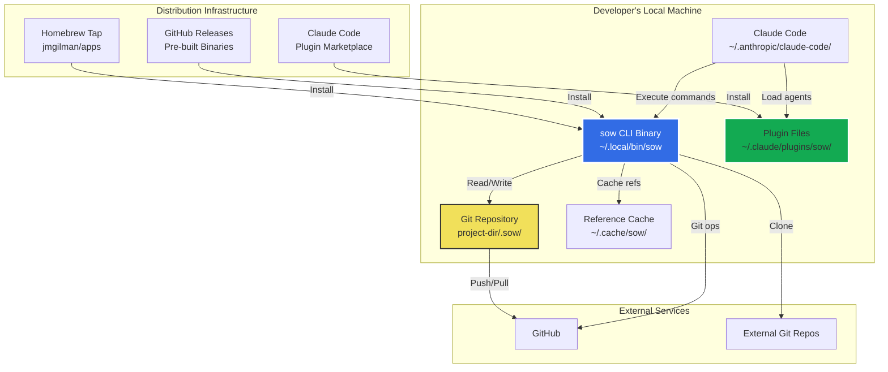
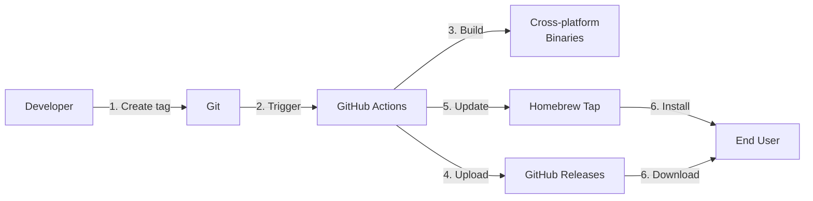
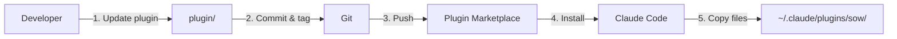
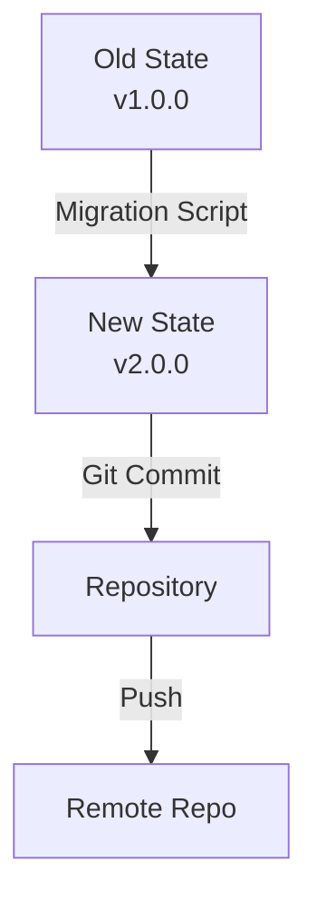

# 7. Deployment View

## Infrastructure Overview



## Deployment Environments

| Environment     | Purpose                       | Infrastructure                                   | User Access                 |
| --------------- | ----------------------------- | ------------------------------------------------ | --------------------------- |
| **Development** | Local development and testing | Developer's machine, git repository, Claude Code | Direct (developer)          |
| **CI/CD**       | Automated testing, releases   | GitHub Actions runners                           | Automated (GitHub Actions)  |
| **End User**    | Production usage              | User's machine, git repository, Claude Code      | Direct (end user/developer) |

### Development Environment

**Purpose**: Local development, testing, and iteration on sow itself

**Components**:
- Source code in `~/code/sow/`
- Go toolchain (1.21+)
- Local git repository
- Claude Code installed
- Test fixtures and in-memory filesystems

**Setup**:
```bash
git clone https://github.com/jmgilman/sow.git
cd sow/cli
go mod download
just build
./sow --version
```

**Testing**:
```bash
just test          # Run unit tests
just ci            # Run all CI checks locally
just coverage      # Generate coverage report
```

---

### CI/CD Environment

**Purpose**: Automated testing, building, and releasing

**Infrastructure**: GitHub Actions hosted runners (Ubuntu, macOS, Windows)

**Workflows**:

1. **Pull Request Checks** (`.github/workflows/pr.yml`)
   - Go fmt, linting (golangci-lint)
   - Unit tests with coverage
   - CUE schema validation
   - Build verification for all platforms

2. **Release** (`.github/workflows/release.yml`)
   - Triggered by git tag push (`v*.*.*`)
   - GoReleaser builds binaries for:
     - Linux: amd64, arm64
     - macOS: amd64, arm64
     - Windows: amd64, arm64
   - Creates GitHub Release with artifacts
   - Updates Homebrew tap (`jmgilman/homebrew-apps`)

**Deployment Steps**:
1. Tag commit: `git tag -a v1.0.0 -m "Release v1.0.0"`
2. Push tag: `git push origin v1.0.0`
3. GitHub Actions builds binaries (GoReleaser)
4. GitHub Release created with binaries
5. Homebrew formula updated automatically
6. Users can install via `brew upgrade sow`

---

### End User Environment

**Purpose**: Production usage by developers building software

**Infrastructure**: User's local machine with git and Claude Code

**Components**:
- sow CLI binary (`~/.local/bin/sow` or `/usr/local/bin/sow`)
- Claude Code plugin files (`~/.claude/plugins/sow/`)
- Git repositories with `.sow/` directories
- Reference cache (`~/.cache/sow/`)
- GitHub CLI (`gh`) for issue/PR operations

**Installation Paths**:

**Option 1: Homebrew (macOS/Linux)**
```bash
brew install jmgilman/apps/sow
```
- Binary installed to: `/usr/local/bin/sow` or `/opt/homebrew/bin/sow`
- Automatically in PATH
- Updates via `brew upgrade sow`

**Option 2: Manual Download**
```bash
# Download from GitHub Releases
tar -xzf sow_v1.0.0_Darwin_arm64.tar.gz
mkdir -p ~/.local/bin
mv sow ~/.local/bin/
chmod +x ~/.local/bin/sow
```
- Binary installed to: `~/.local/bin/sow`
- User must add `~/.local/bin` to PATH

**Option 3: Interactive Installer (via Plugin)**
```bash
claude /sow:install
```
- Auto-detects platform and architecture
- Prefers Homebrew if available
- Falls back to binary download
- Configures PATH if needed

**Plugin Installation**:
```bash
# Via Claude Code
claude plugin marketplace add https://github.com/jmgilman/sow
claude plugin install sow
```
- Plugin files installed to: `~/.claude/plugins/sow/`
- Agents, commands, hooks available in Claude Code

**Repository Initialization**:
```bash
cd my-project
sow init
```
- Creates `.sow/` directory
- Creates `.sow/knowledge/`, `.sow/refs/`
- Writes `.sow/config.yaml`, `.sow/.version`

---

## Deployment Process

### CLI Release Process



**Steps**:
1. **Tag Release**: `git tag -a v1.0.0 -m "Release v1.0.0" && git push origin v1.0.0`
2. **GitHub Actions Triggered**: `.github/workflows/release.yml` runs
3. **Build Binaries**: GoReleaser builds for 6 platforms (Linux, macOS, Windows × amd64, arm64)
4. **Create Release**: GitHub Release created with binaries attached
5. **Update Homebrew**: Homebrew formula automatically updated with new version and checksums
6. **User Installation**: Users install via `brew upgrade sow` or manual download

**Rollback**: If release has issues, delete GitHub Release and tag, fix, re-tag

---

### Plugin Release Process



**Steps**:
1. **Update Plugin Files**: Modify agents, commands, hooks in `plugin/`
2. **Update Version**: Bump `version` in `plugin/.claude-plugin/plugin.json`
3. **Commit and Tag**: Commit changes, tag with plugin version
4. **Push**: Push to GitHub
5. **Marketplace Sync**: Claude Code Plugin Marketplace syncs automatically
6. **User Update**: Users run `claude plugin update sow`
7. **Files Copied**: Plugin files copied to `~/.claude/plugins/sow/`

**Note**: Plugin version independent from CLI version (may diverge)

---

### Repository State Migration

When state structure changes (schema evolution):



**Process**:
1. **Detect Version**: CLI reads `.sow/.version`
2. **Check Compatibility**: Compare with CLI's `StructureVersion`
3. **Run Migration**: Execute migration script if needed
4. **Update Version**: Write new version to `.sow/.version`
5. **Commit Changes**: User commits migrated state
6. **Push**: User pushes to remote (teammates pull migration)

**Example Migration**:
```bash
sow migrate         # Detect and run needed migrations
git add .sow/
git commit -m "Migrate .sow structure to v2.0.0"
git push
```

---

## Platform-Specific Considerations

### macOS
- **Installation**: Homebrew preferred (handles ARM64 vs AMD64 automatically)
- **Binary Location**: `/opt/homebrew/bin/sow` (ARM64) or `/usr/local/bin/sow` (Intel)
- **Symlinks**: Use Unix symlinks for refs (`.sow/refs/` → `~/.cache/sow/repos/`)
- **Shell**: Bash or Zsh (both supported)

### Linux
- **Installation**: Homebrew on Linux or manual download
- **Binary Location**: `/home/linuxbrew/.linuxbrew/bin/sow` or `~/.local/bin/sow`
- **Symlinks**: Use Unix symlinks for refs
- **Shell**: Bash, Zsh, Fish (all supported)

### Windows
- **Installation**: Manual download (no Homebrew)
- **Binary Location**: `C:\Users\<user>\.local\bin\sow.exe`
- **Symlinks**: Use directory copies instead of symlinks (NTFS limitations)
- **Shell**: PowerShell or Git Bash required
- **Line Endings**: Git configured for CRLF → LF conversion on commit

---

## Monitoring and Operations

### Health Checks
- **CLI Version**: `sow --version` reports version and build info
- **Initialization**: `sow validate` checks `.sow/` structure
- **Schema Validation**: Embedded CUE schemas validate state on load
- **Git Status**: CLI checks if in git repository, warns if dirty

### Logging
- **CLI Logging**: Stdout/stderr for user-facing messages
- **Structured Logs**: `.sow/project/log.md`, `.sow/exploration/log.md`, etc.
- **Verbosity**: `--verbose` flag for debug output
- **Error Reporting**: Clear error messages, GitHub issues for bugs

### Backup and Recovery
- **State Backup**: Git versioning provides automatic backup
- **Branch Strategy**: Project state on feature branches, safe to delete after merge
- **Cache Recovery**: Refs cache can be deleted, will re-clone on next use
- **Corrupted State**: `sow validate` detects issues, manual fix via YAML editing

### Performance
- **CLI Startup**: < 50ms for simple commands
- **State Loading**: < 100ms for typical projects
- **Logging**: < 100ms per log entry (append-only writes)
- **Schema Validation**: < 10ms per state file
- **Git Operations**: Variable (depends on repository size, network for push/pull)

---

## Dependencies

### Runtime Dependencies
- **Operating System**: macOS 10.15+, Linux (glibc 2.17+), Windows 10+
- **Git**: 2.20+ (for repository operations)
- **GitHub CLI**: 2.0+ (for issue/PR operations, optional)
- **Claude Code**: Latest version (for AI agent operations)

### Build Dependencies
- **Go**: 1.21+ (for compiling CLI)
- **CUE**: 0.13+ (for schema validation and type generation)
- **just**: 1.0+ (for development commands)
- **golangci-lint**: 1.50+ (for linting)
- **GoReleaser**: 1.20+ (for releases)

### Plugin Dependencies
- None (plugin files are markdown, no build step)
