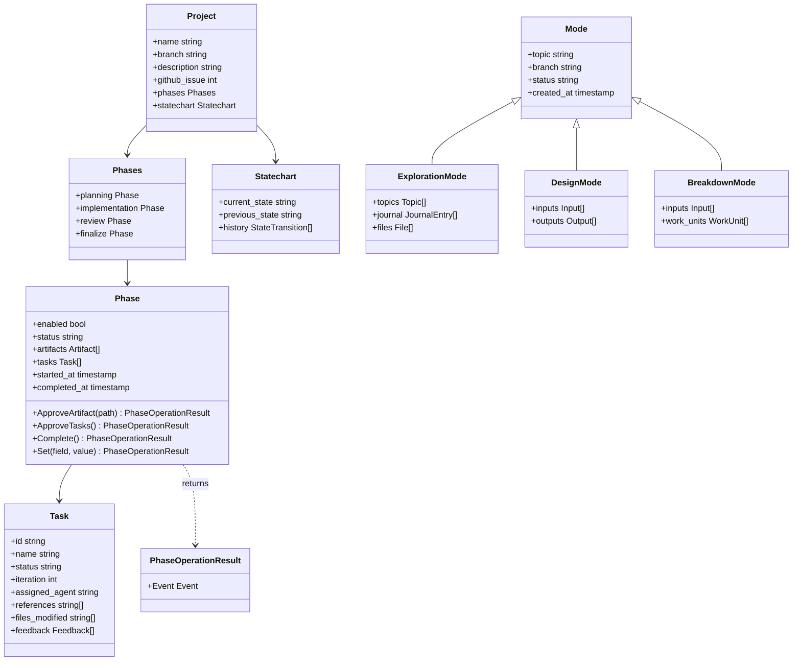

# 8. Cross-cutting Concepts

## Domain Model

### Core Concepts



### Entity Relationships

**Project** is the aggregate root for structured implementation:
- One project per git branch (enforced)
- Owns 4 phases (planning, implementation, review, finalize)
- Tracked by state machine (statechart)
- Linked optionally to GitHub issue

**Phase** represents a stage in the project lifecycle:
- Enabled/disabled via boolean flag
- Status: not_started, in_progress, completed, skipped
- Contains artifacts (planning, review) or tasks (implementation)
- Timestamps track duration

**Task** represents an implementation work item:
- Unique ID (task-001, task-002, etc.)
- Status: pending, in_progress, completed, abandoned
- Iteration counter for feedback loops
- References to external knowledge, refs, code
- Feedback collection for human corrections

**Mode** represents a session-based workflow:
- Exploration: Research and discovery
- Design: Formal documentation creation
- Breakdown: Work decomposition into issues
- One session per branch
- Index tracks inputs/outputs or work units

---

## State Management

### State Persistence Strategy

**Filesystem as Database**: All state stored in YAML/markdown files within `.sow/` directory.

**Atomic Writes**: All state updates use atomic write pattern:
```go
// Write to temporary file
tmpPath := path + ".tmp"
fs.WriteFile(tmpPath, data, 0644)

// Atomic rename (POSIX guarantees atomicity)
fs.Rename(tmpPath, path)

// Cleanup on error
defer fs.Remove(tmpPath)
```

**Schema Validation**: All state validated against CUE schemas before writes:
```go
// Marshal to YAML
data, _ := yaml.Marshal(state)

// Validate against embedded CUE schema
validator.Validate(data, "ProjectState")

// Write only if valid
fs.WriteFile(path, data, 0644)
```

**Null Value Removal**: YAML output omits null fields for readability:
```go
// Encode to YAML node
var node yaml.Node
node.Encode(state)

// Remove null nodes recursively
removeNullNodes(&node)

// Marshal cleaned tree
data, _ := yaml.Marshal(&node)
```

---

### State Synchronization

**Git Versioning**: Project state committed to feature branches:
- `.sow/project/` committed with code changes
- Enables team collaboration via git push/pull
- Provides automatic backup and history

**Branch Switching**: Git checkout automatically switches project context:
- Different branches have different `.sow/project/` state
- No manual cleanup needed (git handles it)
- Enforces one-project-per-branch rule

**Conflict Resolution**: If multiple developers work on same branch:
- State files are YAML (git-mergeable)
- Conflicts surface as merge conflicts
- Developers resolve manually (rare in practice)

---

### State Machine Construction

**Builder Pattern**: Projects construct state machines using the SDK builder:

```go
// Project type creates builder with initial state and prompt generator
builder := statechart.NewBuilder(currentState, projectState, promptGen)

// Add transitions with optional guards
builder.
    AddTransition(State1, State2, Event1).  // Unconditional
    AddTransition(State2, State3, Event2,    // Conditional
        statechart.WithGuard(func() bool {
            return guardCondition(projectState)
        }),
    )

// Build final machine
machine := builder.Build()
```

**Components**:
- **MachineBuilder**: Fluent API for transition configuration
- **PromptGenerator**: Interface for state-specific prompt generation
- **Guards**: Closures that capture project state and determine if transitions are permitted
- **PromptComponents**: Reusable prompt sections (git status, headers, etc.)

**PhaseOperationResult Pattern**: Enables CLI-driven event firing:

```go
// Phase operation returns event declaratively
func (p *Phase) Complete() (*domain.PhaseOperationResult, error) {
    p.state.Status = "completed"
    if err := p.project.Save(); err != nil {
        return nil, err
    }
    // Return event to fire after operation
    return domain.WithEvent(EventPhaseComplete), nil
}

// CLI fires the event
result, err := phase.Complete()
if result.Event != "" {
    machine.Fire(result.Event)
}
```

**Benefits**:
- **Project types own their workflows**: Each project type defines its own states, events, guards
- **CLI stays generic**: No project-type conditionals in CLI layer
- **Declarative events**: Phases specify when transitions occur without directly manipulating state machine
- **Reusable infrastructure**: SDK provides builder, prompt components, common guards

---

## Error Handling

### Error Categories

**1. Domain Errors** (Sentinel Errors)
```go
// Defined in errors.go files
var (
    ErrNotInitialized   = errors.New("not initialized")
    ErrNoProject        = errors.New("no project")
    ErrProjectExists    = errors.New("project already exists")
    ErrTaskNotFound     = errors.New("task not found")
)
```
**Usage**: Checked via `errors.Is(err, ErrNoProject)`

**2. Validation Errors** (Wrapped)
```go
// Wrap with context
return fmt.Errorf("failed to read state file: %w", err)
```
**Usage**: Error chain provides full context for debugging

**3. External Errors** (Adapter Pattern)
```go
// GitHub CLI errors
type ErrGHCommand struct {
    Command string
    Stderr  string
    Err     error
}

// Unwrap support
func (e ErrGHCommand) Unwrap() error {
    return e.Err
}
```
**Usage**: Provides rich error context, supports `errors.Is` and `errors.As`

---

### Error Response Strategy

**CLI Commands**: Exit codes and user-friendly messages:
```go
if err != nil {
    if errors.Is(err, sow.ErrNotInitialized) {
        fmt.Fprintln(os.Stderr, "Error: sow not initialized")
        fmt.Fprintln(os.Stderr, "Run: sow init")
        return 1
    }
    // Generic error
    fmt.Fprintf(os.Stderr, "Error: %v\n", err)
    return 1
}
```

**Agent Interactions**: Agents receive clear error messages via stderr:
```bash
$ sow task set-status invalid
Error: invalid status: invalid (must be pending, in_progress, completed, or abandoned)
```

**Validation Failures**: Schema violations reported with field path:
```bash
$ sow project continue
Error: invalid state file: task.status must be one of [pending, in_progress, completed, abandoned]
Field: phases.implementation.tasks[0].status
Value: "done"
```

---

## Logging and Monitoring

### Structured Logging

**Log Format** (YAML frontmatter + markdown body):
```markdown
---
timestamp: 2025-01-15 10:30:45
agent: implementer-1
action: Implement JWT middleware
result: Created middleware and tests
files:
  - src/auth/jwt.ts
  - tests/auth/jwt.test.ts
---

Implemented JWT middleware using RS256 algorithm.
Added unit tests covering token generation and validation.
Referenced style guide for error handling patterns.
```

**Log Locations**:
- Project: `.sow/project/log.md`
- Task: `.sow/project/phases/implementation/tasks/{id}/log.md`
- Exploration: `.sow/exploration/log.md`
- Design: `.sow/design/log.md`
- Breakdown: `.sow/breakdown/log.md`

**Log Appending**:
```go
entry := &logging.LogEntry{
    Timestamp: time.Now(),
    AgentID:   "orchestrator",
    Action:    "Create task",
    Result:    "Task task-001 created",
    Files:     []string{"task-001/description.md"},
    Notes:     "Assigned to implementer",
}
logging.AppendLog(fs, "project/log.md", entry)
```

---

### Monitoring

**Health Checks**:
```bash
sow validate           # Validate .sow/ structure and schemas
sow --version          # Check CLI version
git status             # Check repository cleanliness
```

**Metrics** (not automated, manual inspection):
- Task completion rate: Count completed vs. total tasks
- Feedback iterations: Average task iteration count
- Phase duration: Timestamp differences in state files

**Alerting** (manual):
- Schema validation failures surface as CLI errors
- State corruption detected on load (validation)
- Git conflicts require manual resolution

---

## Security

### Authentication

**Git Operations**: Inherits user's git credentials:
- SSH keys or HTTPS tokens configured in `~/.gitconfig`
- No additional authentication required by sow

**GitHub Operations**: Uses GitHub CLI (`gh`) authentication:
- `gh auth login` performed by user once
- sow invokes `gh` commands, inheriting auth
- Checks authentication via `gh auth status`

**Claude Code**: No authentication from sow's perspective:
- Claude Code handles user authentication
- sow spawns agents via Task tool (platform internal)

---

### Authorization

**Filesystem Access**: Operating system permissions:
- sow runs as user, inherits user's file permissions
- `.sow/` directory follows repository permissions
- No elevation required

**Repository Access**: Git repository permissions:
- User must have push access to create branches, PRs
- sow respects git configuration (push.default, etc.)

**GitHub API**: GitHub permissions via `gh` CLI:
- User's GitHub token determines API access
- Issue creation requires write access to repository
- PR creation requires push access to branches

---

### Data Protection

**Sensitive Data**: No encryption at rest:
- State files are plain YAML/markdown
- Secrets should not be stored in `.sow/` (use environment variables)
- `.gitignore` protects refs cache from being committed

**Secret Handling**:
- **Do Not Store**: API keys, tokens, passwords in `.sow/` files
- **Use Environment**: `export GITHUB_TOKEN=xxx` for scripts
- **Git Secrets**: Leverage git pre-commit hooks for secret scanning

**Access Control**:
- File permissions: Default to user read/write (0644 files, 0755 directories)
- Git history: Anyone with repo access can read `.sow/` history
- Cache directory: `~/.cache/sow/` readable only by user (0700)

---

## Testing Strategy

### Unit Tests

**Coverage Target**: > 80% code coverage

**Test Organization**:
```
cli/
├── internal/
│   ├── sow/
│   │   ├── context.go
│   │   └── context_test.go
│   ├── project/
│   │   ├── standard/
│   │   │   ├── project.go
│   │   │   └── project_test.go
```

**Test Patterns**:

1. **Table-Driven Tests**:
```go
func TestTaskSetStatus(t *testing.T) {
    tests := []struct {
        name      string
        status    string
        wantError bool
    }{
        {"valid pending", "pending", false},
        {"valid completed", "completed", false},
        {"invalid status", "done", true},
    }
    for _, tt := range tests {
        t.Run(tt.name, func(t *testing.T) {
            // Test implementation
        })
    }
}
```

2. **In-Memory Filesystems**:
```go
func TestStateLoad(t *testing.T) {
    // Use Billy's in-memory filesystem
    fs := memfs.New()
    fs.WriteFile("project/state.yaml", []byte(yamlContent), 0644)

    // Test without touching disk
    state, err := LoadState(fs)
    assert.NoError(t, err)
}
```

3. **Mock Executors**:
```go
type MockExecutor struct {
    RunFunc func(args ...string) (string, string, error)
}

func TestGitHubCreate Issue(t *testing.T) {
    mock := &MockExecutor{
        RunFunc: func(args ...string) (string, string, error) {
            return "https://github.com/org/repo/issues/1", "", nil
        },
    }
    gh := sow.NewGitHub(mock)
    // Test without calling real gh CLI
}
```

---

### Integration Tests

**Scope**: End-to-end workflows without external dependencies

**Example**: Project initialization and task creation:
```go
func TestProjectWorkflow(t *testing.T) {
    // Setup: Create temp directory, init git
    tmpDir := t.TempDir()
    exec.Run("git", "init", tmpDir)

    // Initialize sow
    ctx, _ := sow.NewContext(tmpDir)
    err := sow.Init(tmpDir)
    require.NoError(t, err)

    // Create project
    proj, err := project.NewStandardProject(...)
    require.NoError(t, err)

    // Add task
    task, err := impl.AddTask("Test task")
    require.NoError(t, err)

    // Verify state on disk
    data, _ := os.ReadFile(filepath.Join(tmpDir, ".sow/project/state.yaml"))
    assert.Contains(t, string(data), "test task")
}
```

---

### Manual Testing

**Test Scenarios**:
1. **New Project**: `sow project` on feature branch
2. **Resumption**: Pause, restart CLI, verify continuation
3. **Feedback Loop**: Add feedback, verify iteration increment
4. **Mode Sessions**: Create exploration, design, breakdown sessions
5. **Reference Management**: Add ref, verify cache, check symlink
6. **GitHub Integration**: Create issue, link branch, create PR

**Test Checklist**:
- [ ] Schema validation catches invalid state
- [ ] State machine prevents invalid transitions
- [ ] Atomic writes prevent corruption (kill -9 during write)
- [ ] Zero-context resumption works across sessions
- [ ] Logs format correctly with YAML frontmatter
- [ ] Git operations respect repository configuration
- [ ] GitHub operations handle authentication errors gracefully

---

## Performance Considerations

### Optimization Strategies

**Lazy Loading**: Load state only when needed:
```go
// Don't load project state for sow init
// Do load project state for sow project continue
```

**Efficient Marshaling**: Use single marshal pass:
```go
// Good: Marshal once
data, _ := yaml.Marshal(state)
fs.WriteFile(path, data, 0644)

// Bad: Marshal multiple times
for range files {
    data, _ := yaml.Marshal(state)
    // ...
}
```

**Append-Only Logs**: Avoid file rewrites:
```go
// Good: Append to log
existing, _ := fs.ReadFile("log.md")
updated := append(existing, newEntry...)
fs.WriteFile("log.md", updated, 0644)

// Bad: Rewrite entire log
entries := readAllEntries()
entries = append(entries, newEntry)
writeAllEntries(entries)
```

---

### Performance Targets

| Operation | Target | Measurement |
|-----------|--------|-------------|
| CLI startup | < 50ms | `time sow --version` |
| State load | < 100ms | `time sow project status` |
| Log append | < 100ms | `time sow log "action" "result"` |
| Schema validation | < 10ms | Benchmark tests |
| Task creation | < 200ms | `time sow project add-task "name"` |
| Mode initialization | < 300ms | `time sow design` (new session) |

---

## Internationalization

**Current Status**: English only

**Future Considerations**:
- CLI messages: Use message catalog for translations
- Log format: Keep structured (YAML) language-neutral
- Documentation: Translate Arc42, README to other languages
- State files: Remain English (technical artifact)

**Not Planned**:
- Natural language prompts (Claude Code handles this)
- Error messages (developer tool, English acceptable)
